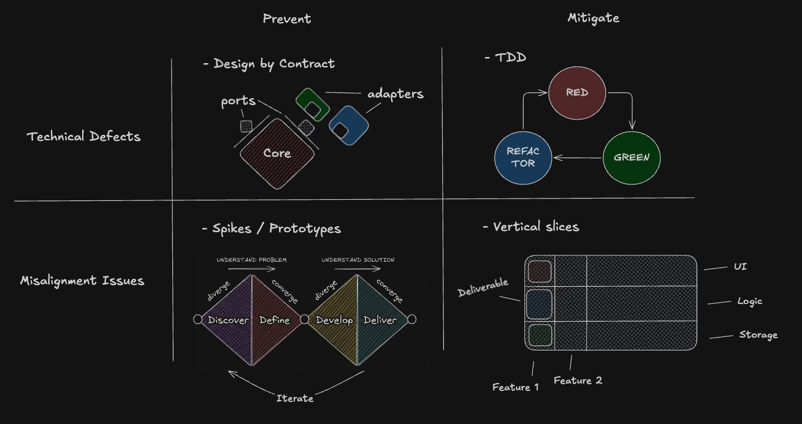
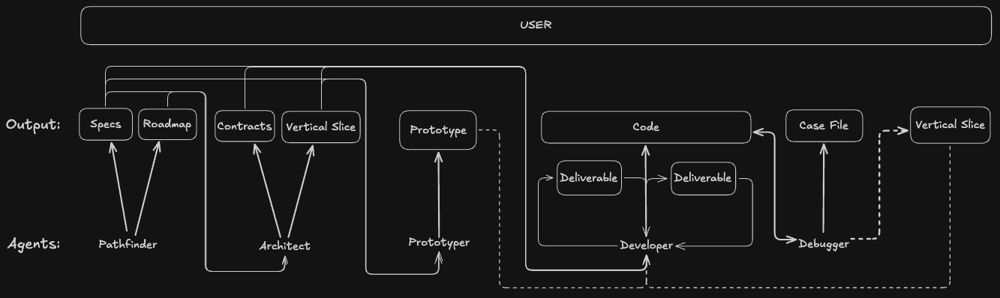

# TeDDy: a very opinionated coding harness

As developers, we've come to accept the premise that working with AI is inherently going to produce low-quality code. This means we either accept it as a trade-off for speed, or avoid using it for that exact reason. I believe it doesn't have to be that way.

TeDDy takes an unconventional approach. It uses **Markdown as Interface** and directly embeds proven software engineering practices like **Test-Driven Development, Hexagonal Architecture, and iterative delivery**.


[](https://www.youtube.com/watch?v=2j2fvRBGtag)


## The Shoulders We Stand On

1.  **[Obsidian](https://obsidian.md/) (Markdown as Interface):** TeDDy adopts a "file-over-app" philosophy. There is no proprietary UI or cloud database; the interface *is* your file system. Your entire collaboration history lives in plain Markdown files on your machine, making it as portable, private, and searchable as the rest of your codebase.
2.  **[Git](https://git-scm.com/book/en/v2/Getting-Started-What-is-Git%3F) (Local-First & Incremental):** Every turn is persisted as an auditable snapshot, logging the plan, execution, and metadata in a transparent file system ledger for total traceability. By enforcing a local-first, incremental workflow, TeDDy ensures that your project's history is auditable and that changes are delivered in small, verifiable units rather than a massive, one-shot monolith.
3.  **[The UNIX Philosophy](https://en.wikipedia.org/wiki/Unix_philosophy) (Small, Sharp Tools):** Instead of one "do-everything" agent, TeDDy breaks down the development process into specialized roles. Each agent acts following a specific workflow, and the interaction between them is mediated only through plaintext documents, which act as an additional layer of abstraction for the user to steer the project at a high level. Each agent's workflow is further broken down into distinct phases and transition rules. These are defined in plain-text XML files, designed to make it as easy as possible to fine-tune and personalize the workflow.

## Why LLMs Suck at Software Development

At its core, an AI agent is a language model paired with a harness. LLMs are trained for next-token prediction and optimized for short-term, atomic tasks. They naturally try to generate the final solution in one shot, which makes the **defects they introduce compound** turn after turn.

Addressing and preventing defects has been a central problem for software engineering long before LLMs became a thing. So maybe we should take a page out of real software engineering practices, that have been proven over decades, and apply them to AI-assisted software development as well.

We can conceptually split **defects in software** into two categories:

- **Technical**: code that simply doesn't work the way it's intended.
- **Misalignment**: code that technically works but isn't what the user(s) actually wanted.

Current coding harnesses don't address these issues at all and frontier models are also hitting diminishing returns, leaving users trying to fix these by bolting on external systems like MCPs, skill files and spec-driven development, leading to a messy and frustrating development experience.

TeDDy instead attempts to solve these issues directly by adopting, amongst others, the following strategies:
- **For Technical Defects:** TeDDy enforces a strict **Test-Driven (Red-Green-Refactor)** cycle and **continuous delivery using Git**. To prevent errors from compounding, the AI must write a test first and commit its progress in small, atomic units. At startup, the harness verifies that Git and pre-commit hooks are initialized to ensure that **pre-commit checks** (linters and quality) and **post-commit test runs** (ensuring a "green-to-green" state) are active. This local safety net is designed to prevent defective code from ever reaching the remote repository and works in synergy with a **CI/CD workflow** to catch platform-dependent issues.
- **For Misalignment:** TeDDy is designed to drive your intent through the entire agent lifecycle by using specific **Markdown Documents** to mediate transitions between project phases. These documents serve as anchoring for the agents while providing a high-level interface for you to steer the project at every step. The workflow moves from high-level **Specification Documents and Milestones** to granular **Component Design Docs** that enforce **Hexagonal Architecture** through defined Ports and Contracts. By delivering features through **Vertical Slices** and **Gherkin Scenarios**, agents produce working pieces of software for you to review and verify at the end of each iteration, ensuring the system doesn't drift away from your vision.



## The TeDDy Workflow

TeDDy breaks down the development process into distinct agents, each with a specific mandate. Their interaction is mediated through documents, letting you steer the project at a high level throughout.



1. **Pathfinder:** Navigates from a vague idea to a technically-grounded roadmap. Explores *why*, *what*, and *how*, then helps you concretize it into a plan.
2. **Architect:** Defines contracts, boundaries, and vertical slices for the Developer. Uses spikes to de-risk uncertain approaches before committing to an architecture.
3. **Prototyper:** Builds standalone prototypes to validate uncertain features before the Developer implements them.
4. **Developer:** Implements features one deliverable at a time using a strict **Red-Green-Refactor** loop.
5. **Debugger:** Uses the scientific method to isolate root causes by building minimal reproduction cases.
6. **Assistant:** A flexible agent that follows your instructions without enforcing a strict process. Use it as a template for custom agents or for tasks that don't require the full disciplined workflow.

> **Note:** Each agent's workflow is defined in plain-text XML files under `.teddy/prompts/`. You can customize any agent to fit your needs or create new ones for specific use cases.

## Getting Started

#### Prerequisites
- Python 3.11 or later.
- `pip` (included with Python) or `uv` (recommended).

#### Install TeDDy

```bash
uv tool install teddy-cli
```

#### Initialize

```bash
teddy init
```

Use subcommands to overwrite specific files with defaults:

- `teddy init prompts` – Overwrite bundled prompt XMLs in `.teddy/prompts/` (useful after upgrades).
- `teddy init config` – Overwrite config.yaml, .gitignore, and init.context with defaults.

#### LLM Configuration

Edit `.teddy/config.yaml`:

```yaml
llm:
  api_key: "your-openrouter-api-key-here"
  model: "openrouter/deepseek/deepseek-v4-flash:nitro"
```

> **Note:** You can update the `model` field to switch providers/models. TeDDy defaults to the [OpenRouter API](https://openrouter.ai/) which supports hundreds of models. To change the model, simply edit the `model` value in your config.

#### Editor Configuration

Set your preferred editor for reviewing and modifying plans:

```yaml
editor: "nvim"
```

If no editor is configured, TeDDy will use the system default. Supported editors include `nvim`, `vim`, `code`, and any editor available on your `PATH`.

#### Start a session

```bash
teddy start
```

Run with `--yolo` / `-y` for automatic approval:

```bash
teddy start -y
```

Resume a previous session:

```bash
teddy resume
```

#### Optional flags

- `--agent` / `-a` – Choose an agent persona (e.g., `pathfinder`, `architect`, `developer`).
- `--context` / `-c` – Pass additional context files or directories.
- `--model` / `-m` – Override the default model.

#### Browser chat usage

1. Copy the system prompt for your desired agent. You can either:
   - Use `teddy get-prompt` (e.g., `teddy get-prompt -a assistant`), or
   - Copy the contents directly from a prompt file (e.g., `.teddy/prompts/assistant.xml`).
2. Run `teddy context` to copy your project context to the clipboard.
3. Paste it into an LLM chat interface alongside your request.
4. Have the model generate a Markdown plan.
5. Copy the plan and run `teddy execute` (or `teddy execute -y` for automatic execution).

### Installing Experimental Versions

To install or upgrade to the latest experimental (pre-release) version from TestPyPI:

```bash
uv tool install teddy-cli --pre --force --index-url https://test.pypi.org/simple/ --extra-index-url https://pypi.org/simple/ --index-strategy unsafe-best-match
```

> **Note:** Experimental versions are published to TestPyPI and may include features that are not yet stable. Use with caution.

### Command Reference

| Command        | Description                                                                                    |
| -------------- | ---------------------------------------------------------------------------------------------- |
| `init`         | Initialize `.teddy` directory with defaults and pre-warm heavy imports. See subcommands below. |
| `init prompts` | Overwrite bundled prompt XMLs in `.teddy/prompts/` with defaults.                              |
| `init config`  | Overwrite config.yaml, .gitignore, and init.context with defaults.                             |
| `start`        | Start an interactive session.                                                                  |
| `resume`       | Resume an existing session.                                                                    |
| `update`       | Check for updates and display upgrade instructions.                                            |
| `execute`      | Execute a Markdown plan. Reads from clipboard if no file path provided.                        |
| `context`      | Gather project context (file tree + selected file contents) to clipboard.                      |
| `get-prompt`   | Retrieve agent system prompts. Respects `.teddy/prompts/` overrides.                           |

By default, `execute` and `context` copy their output to the clipboard. Use `--no-copy` to disable.

## Learn More

- [Project Roadmap & Vision](/docs/project/PROJECT.md)
- [System Architecture](/docs/architecture/ARCHITECTURE.md)
- [Agent Prompt Templates](/src/teddy_executor/resources/config/prompts/)
