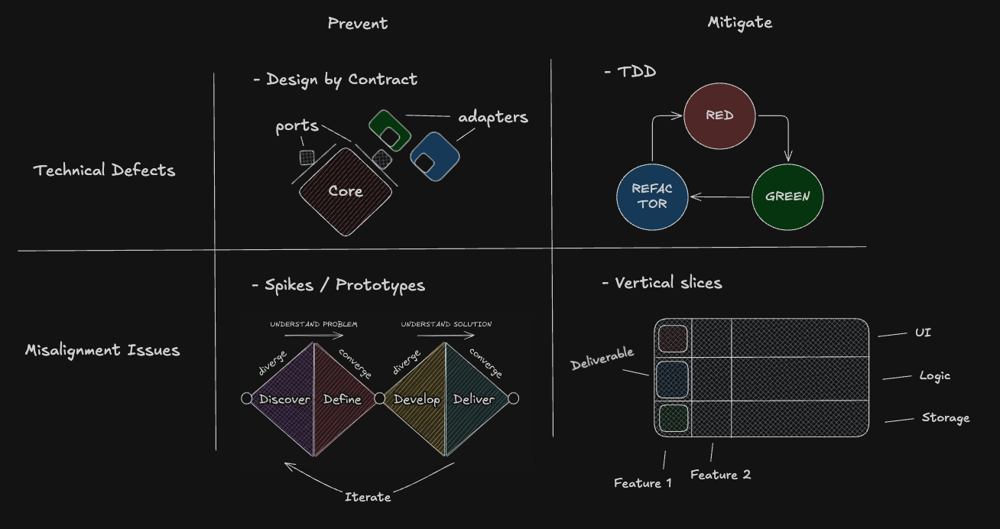
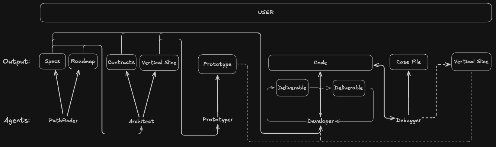

<div align="center">

# TeDDy

### The opinionated software engineering harness

<p align="center">
  <em>Because you should own the means of development</em>
</p>

[](https://pypi.org/project/teddy-cli/)
[](https://www.python.org/)
[](LICENSE)

<br />

**TeDDy brings Test-Driven Development, Hexagonal Architecture, and local plaintext workflows to coding agents.**

[Quickstart](#getting-started) &bull; [Workflow](#the-teddy-workflow) &bull; [Learn More](#learn-more) &bull; [Video Demo](#video-walkthrough)

</div>

---

The [2025 DORA report](https://dora.dev/research/2025/) found that AI adoption raises delivery throughput and product performance, but remains negatively related to delivery stability: code moves faster, but disproportionately more of it breaks. Any gains in raw speed are counterbalanced by increased effort needed for reviewing and reworking "slop" code to avoid technical defects and misalignment from compounding. Teams with fast feedback loops and loosely coupled systems see the most gain, while teams with inefficient processes and tight coupling see little or no benefit.

[Bain's 2026 Technology Report](https://www.bain.com/insights/the-missing-architecture-for-agentic-software-development-technology-report-2026/) reaches the same conclusion from the other side: the bottleneck has moved. The limiting factor is no longer the model, but the connective architecture around it: *"the system reverts to the throughput of its slowest human checkpoint."* Better models will not by themselves fix the instability they cause.

TeDDy addresses these bottlenecks by bringing proven engineering practices like **Test-Driven Development, Hexagonal Architecture, and iterative delivery** directly into your agentic workflow, using only local plaintext files that you can read, review, and change, with nothing hidden in a proprietary database or cloud service.

---

### Video Walkthrough

<p align="center">
  <a href="https://www.youtube.com/watch?v=2j2fvRBGtag">
    
  </a>
</p>

---

## Why Not Just Use...

<details>
<summary><strong>...Skill.md files?</strong></summary>

<br />

With skills, you most often carry out the process yourself, switching between multiple ad hoc skill files as you go, so you end up driving the process instead of setting the direction. Skills also add overhead, and they stack on top of your harness's own system prompt, which shifts under you with new versions and can conflict with your own instructions.

A skill file describes a process; TeDDy runs it, splitting the work across specialist agents and keeping the instructions as part of the system prompt rather than the context window, where large skills get truncated and older ones get dropped as the session grows. Skills are best kept as a tactical addition, and your existing skill files still work inside TeDDy.

</details>

<details>
<summary><strong>...Spec-driven development?</strong></summary>

<br />

Spec-driven development makes you write down exactly what the software should do before writing any code. Leaving aside the fact that any spec detailed enough just becomes code, this is essentially just the [waterfall model](https://en.wikipedia.org/wiki/Waterfall_model) in a new outfit, which front-loads the analysis on the assumption that the requirements defined up front will be correct.

That assumption rarely holds. People often do not know what they want until they see it, and any non-trivial system will run into edge cases that could not have been predicted upfront. Agile was born to shorten the loop between building something and using it, so mistakes surface while they are still cheap to fix and the design can adapt to what you learn along the way. TeDDy does use specifications, but as living documents inside an iterative process built around incremental design.

</details>

<details>
<summary><strong>...Automation?</strong></summary>

<br />

A common reaction to the drawbacks agents cause, like more review and more rework, is to stack more agent automations on top, such as pre-PR review bots. This relocates the bottleneck instead of removing it.

Bain's report puts it directly: companies that speed up code generation without redesigning the surrounding process *"don't compound their gains; they redistribute their pain. Every bottleneck AI removes exposes the next one."* Adding another review step on top of an unchanged process just moves the slowest checkpoint further down the line.

</details>

---

## What Makes TeDDy Special

1. **Markdown as the interface.** Inspired by [Obsidian](https://obsidian.md/)'s file-over-app philosophy, the file system is the interface, not a chat box. Documents are the medium of communication, editable in any editor, and responses are plain Markdown, executable through the CLI or any external UI.
2. **Local-first architecture.** Inspired by the [UNIX philosophy](https://en.wikipedia.org/wiki/Unix_philosophy) of small, sharp tools communicating via plain text, everything lives directly on disk in your workspace with no cloud dependency and no vendor lock-in. Your configuration and the agent workflows are stored as plain, open files.
3. **Auditable by design.** Inspired by [Git](https://git-scm.com/)'s self-contained local ledger model, every turn records the agent's reasoning, justification, and expectations in plaintext on disk, making sessions traceable, searchable, and auditable even on closed-token models.

---

## Why Working Code Is Not Enough

A coding agent is a language model paired with a harness. LLMs are trained for next-token prediction and optimized for short, atomic tasks, so they are good at producing code that works in the moment and poorly suited to the long game of keeping code, intent, and a team aligned over time. Left alone, a model tries to generate the final solution in one shot, and the defects it introduces compound turn after turn.

The defects that reach production come in two kinds:

- **Technical:** code that does not work the way it was intended.
- **Misalignment:** code that works but is not what the user or the team actually wanted.

Most coding harnesses do little to address either one, leaving users bolting on external systems like MCP servers, skill files, and spec-driven tooling. TeDDy addresses both:

- **Technical defects:** Builds a strict **Test-Driven (Red-Green-Refactor)** cycle into the workflow and enforces the commit gate through Git hooks. The agent writes a test first and commits in small units, surfacing errors early. At startup, the harness verifies that Git and the hooks are in place, and the post-commit test run keeps checks passing before and after every change.
- **Misalignment:** Specific **Markdown documents** mediate every phase transition, anchoring the agents and providing a high-level steering interface. The workflow moves from **Specification Documents and Milestones** to **Component Design Docs** enforcing **Hexagonal Architecture** through defined ports and contracts. Features ship through **Vertical Slices** and **Gherkin Scenarios** for continuous verification.

<p align="center">
  
</p>

---

## The TeDDy Workflow

TeDDy breaks down the development process into distinct agents, each with a specific mandate. Their interaction is mediated through documents, letting you steer the project at a high level throughout.

<p align="center">
  
</p>

1. **Pathfinder:** Navigates from a vague idea to a technically-grounded roadmap. Explores *why*, *what*, and *how*, then concretizes it into an actionable plan.
2. **Architect:** Defines contracts, boundaries, and vertical slices for implementation. Uses spikes to de-risk uncertain approaches before committing to an architecture.
3. **Prototyper:** Builds standalone prototypes to validate uncertain features before implementation.
4. **Developer:** Implements features one deliverable at a time using a strict **Red-Green-Refactor** loop.
5. **Debugger:** Uses the scientific method to isolate root causes by building minimal reproduction cases.
6. **Assistant:** A flexible agent that follows instructions without enforcing strict processes. Useful as a template for custom agents or lightweight tasks.

> [!NOTE]
> Each agent's workflow is defined in plain-text XML files under `.teddy/prompts/`. You can customize existing agents or add new ones for specific use cases.

---

## Getting Started

### Prerequisites

- Python 3.11 or later
- `pip` (included with Python) or `uv` (recommended)

### Install TeDDy

```bash
uv tool install teddy-cli
```

### Installing Experimental Versions

To install or upgrade to the latest development pre-release directly from PyPI:

```bash
uv tool install teddy-cli --pre --force
```

> [!WARNING]
> Experimental versions are published as PEP 440 dev pre-releases on PyPI and may include breaking changes or unstable features.

### Initialize

```bash
teddy init
```

Use subcommands to overwrite specific defaults:

- `teddy init prompts`: Overwrite bundled prompt XMLs in `.teddy/prompts/` (useful after upgrades).
- `teddy init config`: Overwrite `config.yaml`, `.gitignore`, and `init.context` with defaults. Preserves existing `.env` files.
- `teddy init templates`: Overwrite bundled Markdown templates in `docs/templates/` with defaults.

### Configuration

The first execution of `teddy start` runs an interactive setup that writes your LLM API key to `.teddy/.env` and your preferred editor to `.teddy/config.yaml`.

To configure manually, edit `.teddy/config.yaml`:
- `llm.model`: Model path from [openrouter.ai/models](https://openrouter.ai/models) (default: OpenRouter).
- `llm.api_key`: Defaults to `${TEDDY_LLM_API_KEY}` via `.teddy/.env` or literal string.
- `editor`: Executable name in `PATH`, absolute path, or `"disabled"`.

All `llm.*` keys pass through to [LiteLLM](https://docs.litellm.ai/docs/completion/input), including parameters like `extra_body`.

---

## Usage

### Starting and Resuming Sessions

```bash
# Start an interactive session (defaults to Pathfinder)
teddy start

# Start with automatic action approval (non-interactive)
teddy start -y

# Start with a specific agent and prompt
teddy start -a architect -m "Plan the auth module"

# Resume the most recent session
teddy resume

# Resume a specific session by slug or path
teddy resume my-feature-branch
teddy resume .teddy/sessions/20260825_151900-my-feature-branch

# Resume an ongoing session with a different agent persona
teddy resume -a developer
```

Interrupt a running session with `q` or `Ctrl+C` at any time. The action currently in flight will stop immediately, remaining actions will be skipped, and the report will be written to preserve the audit trail. Resume or steer with:

```bash
teddy resume -m "your next instruction"
```

### Optional Flags

- `--agent` / `-a`: Select agent persona (`pathfinder`, `architect`, `developer`, `debugger`, `assistant`). Default: `pathfinder`.
- `--context` / `-c`: Supply additional context files or directories. Repeatable (`-c a.py -c b.md`) or comma-separated (`-c "a.py,b.md"`).
- `--model`: Override the default configured model.
- `--yolo` / `-y`: Auto-approve all actions. To make this default, set `yolo_default: true` in `.teddy/config.yaml`.
- `--no-yolo` / `-n`: Force interactive mode for a single run.
- `--message` / `-m`: Initial instruction to pass directly to the agent.
- `--pipeline` / `-p`: Pipeline mode. Auto-approves actions, requires `-m`, and exits immediately after the first message turn.

### Browser Chat Usage

1. Copy the system prompt of the target agent: `teddy get-prompt -a assistant`
2. Copy project context to your clipboard: `teddy context`
3. Paste context and system prompt into any external chat interface (Claude, ChatGPT, Google AI Studio, etc.) alongside your request.
4. Prompt the model to return an executable Markdown plan.
5. Copy the generated response and run `teddy execute` (or `teddy execute -y`).

---

## Command Reference

| Command          | Description                                                                   |
| :--------------- | :---------------------------------------------------------------------------- |
| `init`           | Initialize `.teddy` workspace with defaults and pre-warm dependencies.        |
| `init prompts`   | Overwrite bundled prompt XMLs in `.teddy/prompts/` with defaults.             |
| `init config`    | Overwrite `config.yaml`, `.gitignore`, and `init.context` with defaults.      |
| `init templates` | Overwrite bundled Markdown templates in `docs/templates/` with defaults.      |
| `start`          | Start an interactive agent session.                                           |
| `resume`         | Resume an existing session.                                                   |
| `update`         | Check for updates and display upgrade instructions.                           |
| `execute`        | Execute a Markdown plan. Reads from clipboard if no file path is provided.    |
| `context`        | Export project context (file tree + selected file contents) to clipboard.     |
| `get-prompt`     | Retrieve agent system prompts. Respects local overrides in `.teddy/prompts/`. |

*Note: By default, `execute` and `context` copy output to the clipboard. Use `--no-copy` to bypass.*

---

## Learn More

- [Project Roadmap & Vision](/docs/project/PROJECT.md)
- [System Architecture](/docs/architecture/ARCHITECTURE.md)
- [Agent Prompt Templates](/src/teddy_executor/resources/config/prompts/)
