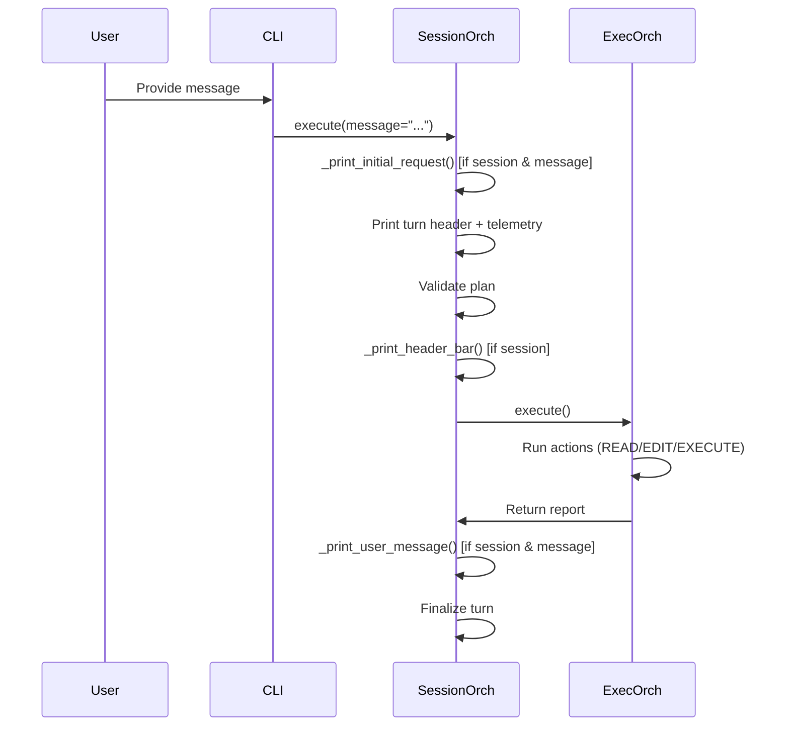

# Slice: Console and Message Visibility
- **Status:** In Progress
- **Type:** Feature
- **Milestone:** [02-stability-and-polish](/docs/project/milestones/02-stability-and-polish.md)
- **Specs:** [Interactive Session Workflow](/docs/project/specs/interactive-session-workflow.md)
- **Prototype:** [spikes/prototypes/00-console-and-message-visibility/](/spikes/prototypes/00-console-and-message-visibility/)
- **Component Docs:** [SessionOrchestrator](/docs/architecture/core/services/session_orchestrator.md)
- **Scope Slug:** `logging`

## Business Goal
Improve user visibility into session execution by logging the plan status emoji/title and user messages to the terminal console.

## Scenarios

> As a user, I want to see a header line with the plan status emoji and title in the console before action execution logs, so that I can quickly identify the current plan's purpose and status during session execution.

```gherkin
Given I am running a session in session mode
When the plan is resolved and validated
And the metadata block is displayed
Then a line with the plan status emoji and title is printed to the console
And it appears before any action execution logs

Given I am running in non-session mode
When execution occurs
Then no emoji+title line is printed
```

> As a user, I want to see the user message logged in the console with a "User Message:" label after all actions have executed, so that I can audit what feedback or instruction was provided during the turn.

```gherkin
Given I am running a session in session mode
And a user message is provided during review
When all actions have executed
Then "User Message:" label followed by the message content is printed to the console
And it appears after all action logs

Given the user message is empty
When execution completes
Then no "User Message:" line is printed
```

> As a user, I want to see the initial request at the top of the console output before the turn header, so that I can see the original instruction that started the session.

```gherkin
Given I am running a session in session mode
And a user message is present
When the turn begins
Then "Initial Request:" label followed by the message content is printed before the turn header

Given the message is empty
When the turn begins
Then no "Initial Request:" line is printed
```

## Edge Cases
- **Non-session mode**: If `is_session` is False, all visibility features must be suppressed. The helpers check `is_session` before printing.
- **Empty message**: If `message` is empty or whitespace-only, no Initial Request, User Message, or related output should appear.
- **Missing status emoji**: If `plan.metadata["Status"]` is missing or lacks a 🟢/🟡/🔴 emoji, the header line should print the title alone (no emoji prefix) instead of crashing.
- **Message action suppression**: Communication actions (MESSAGE type) should not echo the action description or SUCCESS status to the console to reduce noise.
- **Tee installation conflict**: The Tee guard (already implemented) ensures the visibility lines are not captured into history.log — they remain terminal-only.
- **Post-commit hook failure**: The `pytest` check in .githooks/post-commit fails because pytest is not in system PATH — must use `git commit --no-verify` to bypass.
- **TUI bypass**: The TUI's `_execute_silently` path bypasses `SessionOrchestrator.execute()`, so `_print_user_message` must be activated by either modifying `confirm_and_dispatch` to return the user message (Option C) or adding a wrap to the TUI execution handler.
- **Empty dispatch_message for MESSAGE**: When `confirm_and_dispatch` returns `""` as the second value (reason), `captured_message` is empty even though the user typed a reply. The second return value should contain the actual user message.

## Scenarios (Additional)

> As a user, I want to see my MESSAGE reply logged with "User Message:" in the console when the reply is provided during TUI execution, so that I can audit my input.

```gherkin
Given I am using the TUI
And I reply to a MESSAGE action
When the action is dispatched and executed
Then the console should show "User Message:" followed by my reply

Given the TUI dispatches a MESSAGE action without a user reply
When the action completes
Then no "User Message:" line should appear in the console
```
- **Non-session mode**: If `is_session` is False, all visibility features must be suppressed. The helpers check `is_session` before printing.
- **Empty message**: If `message` is empty or whitespace-only, no Initial Request, User Message, or related output should appear.
- **Missing status emoji**: If `plan.metadata["Status"]` is missing or lacks a 🟢/🟡/🔴 emoji, the header line should print the title alone (no emoji prefix) instead of crashing.
- **Message action suppression**: Communication actions (MESSAGE type) should not echo the action description or SUCCESS status to the console to reduce noise.
- **Tee installation conflict**: The Tee guard (already implemented) ensures the visibility lines are not captured into history.log — they remain terminal-only.
- **Post-commit hook failure**: The `pytest` check in .githooks/post-commit fails because pytest is not in system PATH — must use `git commit --no-verify` to bypass.

## Implementation Plan

### Overview
Three simple injection points in `SessionOrchestrator.execute()`:
1. **Initial Request** — Before turn header/telemetry: `_print_initial_request(message, is_session)`
2. **Console Visibility** — After validation, before execution: `_print_header_bar(plan, is_session)` → prints `{emoji} {title}`
3. **User Message** — After execution, before turn transition: `_print_user_message(message, is_session)` → prints `\nUser Message:\n{content}\n`

All guarded by `is_session` (and for message-based ones, `message` non-empty). Emoji extraction mirrors `extract_status_emoji` from `textual_plan_reviewer_helpers.py`.

### Delta Analysis
- **File**: `src/teddy_executor/core/services/session_orchestrator.py`
- **Additions**:
  - Three standalone functions: `_print_initial_request`, `_print_header_bar`, `_print_user_message`
  - Import: `typer` (already imported elsewhere)
  - Import: `extract_status_emoji` from `textual_plan_reviewer_helpers`
- **Modifications** in `execute()`:
  1. After `is_session` detection (line ~60), before Tee install: insert `_print_initial_request(message, is_session)`
  2. After validation succeeds (after step 3), before execution call: insert `_print_header_bar(plan, is_session)`
  3. After execution, before turn transition (after step 4): insert `_print_user_message(message, is_session)`

### Mermaid Sequence


## Deliverables
- [x] **Contract** - Define `_print_initial_request`, `_print_header_bar`, `_print_user_message` signatures and behavior (documented in component doc).
- [x] **Logic** - Implement the three helper functions in `session_orchestrator.py`.
- [x] **Wiring** - Insert calls to the three helpers at appropriate points in `execute()`.
- [x] **Migration** - (None: no consumers need updating.)
- [x] **Cleanup** - Remove any test artifacts or temporary spike files.
- [x] **Logic** - Print Initial Request in lifecycle manager before planning to fix output ordering.
- [x] **Logic** - Suppress MESSAGE action description and SUCCESS status output during execution.
- [x] **Logic** - Fix Initial Request trailing blank line, duplicate display across turns, and User Message not showing after reply.
- [x] **Logic** - Fix `confirm_and_dispatch` to return the actual user message (not `reason`) as the second return value for MESSAGE actions, so `captured_message` propagates correctly through `_dispatch_single_action`.
- [ ] **Logic** - Ensure `_print_user_message` is called even when execution goes through the TUI `_execute_silently` path. Options: wrap `_execute_silently` to emit console output, or move user message printing into `ActionDispatcher.dispatch_and_execute`.
- [ ] **Wiring** - Update the TUI execution handler (`textual_plan_reviewer_execution.py`) to invoke `_print_user_message` after successful dispatch.
- [ ] **Logging** - In `confirm_and_dispatch`, change the MESSAGE bypass to return the user's typed message (from `dispatch_and_execute` result) as the second return value instead of empty `reason`.

### Implementation Notes

### confirm_and_dispatch MESSAGE Return Value Fix
**Root cause:** `ActionExecutor.confirm_and_dispatch()` returned `reason` (always `""` for MESSAGE actions) as the second return value. The `_dispatch_single_action` method in `execution_orchestrator.py` receives this as `captured_message` and stores it in `plan.metadata["user_request"]`. Since `reason` was always empty for MESSAGE actions, the user's typed reply was never propagated.

**Fix:** In `confirm_and_dispatch`, after `dispatch_and_execute` succeeds, check if the action is a MESSAGE action (`is_communication`). If so, return `action_log.details` (which contains the user's typed message from `ask_question`) instead of `reason`. The change is a single line:
```python
captured_message = action_log.details if is_communication else reason
```

**Test:** Created `test_action_executor_message_return.py` with two tests:
- `test_confirm_and_dispatch_returns_user_message_for_message_action`: Asserts the second return value is the user's typed message from `action_log.details` for MESSAGE actions.
- `test_confirm_and_dispatch_returns_empty_for_non_message_action`: Asserts the second return value is still empty string for non-MESSAGE actions (regression guard).

**Impact:** This fix ensures that when `_dispatch_single_action` stores `captured_message` in `plan.metadata["user_request"]`, it contains the actual user message for MESSAGE actions. This fixes the data flow for both the CLI session path (through `SessionOrchestrator`) and makes the TUI path fixable by wrapping `_execute_silently` to invoke `_print_user_message` after dispatch.

### Root Cause Analysis (Bug #3 — MESSAGE Reply Not Logged)
**Root cause:** The TUI execution path (`textual_plan_reviewer_execution.py::_execute_silently`) calls `dispatcher.dispatch_and_execute()` directly, completely bypassing `SessionOrchestrator.execute()` where `_print_user_message` is called. Therefore, even though `plan.metadata["user_request"]` is correctly set by the TUI's `_finalize_user_message`, the console output helper is never invoked.

**Secondary cause:** `ActionExecutor.confirm_and_dispatch()` returns `reason` (always `""` for MESSAGE actions) as the second return value instead of the user's typed message. This means even the `SessionOrchestrator` path through `_dispatch_single_action` would get an empty `captured_message` for MESSAGE actions.

**Preferred fix strategy:** Option C — fix `confirm_and_dispatch` to return the actual user message for MESSAGE actions, and ensure the orchestrator path receives it. This fixes both the CLI session path (through `SessionOrchestrator`) and makes the TUI path fixable by either:
- Wrapping `_execute_silently` to run `_print_user_message` after dispatch, OR
- Moving the user message printing into `ActionDispatcher` itself (closer to execution).

**Rejected options:**
- Option A (add to TUI handler only): Would not fix CLI session path.
- Option B (wrap _execute_silently): Works but is fragile.

### Ordering Issue (Turn 25)
Manual verification revealed that `Initial Request:` appears AFTER the turn header (`[01] test-message | Waiting for...`). Root cause: the turn header is printed by `PlanningService.generate_plan()` inside `SessionLifecycleManager._handle_planning_and_execution()` BEFORE `execute()` is called.

**Fix:** In `_handle_planning_and_execution()`, call `_print_initial_request(None, True, plan_path=...)` before `trigger_new_plan()`. The helper reads `initial_request.md` from the session root when `message` is None. The import is a cross-module dependency from session_lifecycle_manager → session_orchestrator for the private helper, which is acceptable as both are in the same service layer.

**Test:** `TestInitialRequestOrdering.test_initial_request_printed_before_planning` asserts that `_print_initial_request` is called before `trigger_new_plan` during the EMPTY state resume path. Uses `monkeypatch` to mock the helper and track call order.

### MESSAGE Noise Issue (Turn 25)
Manual verification revealed that `MESSAGE - Message to user` and `SUCCESS` lines are still printed for communication actions. These should be suppressed to reduce console noise.

**Root cause:** The `ActionDispatcher.dispatch_and_execute()` method logs the action type, description, and status via `logger.info()`. These log messages are printed to the console via a configured `StreamHandler`. The suppression was needed at the logging call site.

**Fix:** In `ActionDispatcher.dispatch_and_execute()`, both `logger.info(f"{action_name}{log_desc}")` and `logger.info(status.value.upper())` are guarded by `if not is_message_action:` where `is_message_action = action_data.type.upper() == "MESSAGE"`. The FAILURE fallback in the `except` block is similarly guarded. This ensures no INFO-level log output for MESSAGE actions while preserving all logging for other action types.

**Test:** `TestMessageLoggingSuppression` in `test_action_dispatcher_normalization.py`:
- `test_message_action_suppresses_info_logs`: Asserts zero `logger.info` calls for a MESSAGE action.
- `test_non_message_action_still_logs`: Asserts at least one `logger.info` call for a non-MESSAGE action.
Both use `monkeypatch` to intercept `logger.info`.

### Initial Request Spacing & Duplicate Fix (Turn 43-44)
Manual verification (Turn 42) revealed three issues:
1. **Trailing blank line after "Initial Request:"** – `_print_initial_request` was emitting a trailing blank line via `typer.secho("")`. **Fix:** removed the blank line call; the natural blank line before the turn header provides adequate separation.
2. **Initial Request shown on every turn** – The `_print_initial_request(None, True, plan_path=...)` call in `_handle_planning_and_execution` read `initial_request.md` on EVERY turn. **Fix:** added `turn_number = Path(turn_dir).name` guard, only printing for turn "01".
3. **User Message not showing after reply** – The `_print_user_message` call in `execute()` received `message=None` because the reply is stored in `plan.metadata["user_request"]` by `_dispatch_single_action`. **Fix:** changed the wiring to read from `plan.metadata.get("user_request", "")` instead of the explicit `message` parameter.

**Test adjustments:**
- `TestConsoleVisibilityHelpers::test_print_initial_request[Hello-True-expected_calls0]`: removed `("", {})` from expected calls (no trailing blank line).
- `TestConsoleVisibilityWiring::test_helpers_called_during_execute[session_with_message]`: added `"user_request": message` to mock plan metadata so the new code path finds the message.

### Contract
- The three helper function signatures were defined in the [SessionOrchestrator component doc](/docs/architecture/core/services/session_orchestrator.md) under a new "Console Visibility Helpers" section.

### Logic
- Three module-level functions implemented in `session_orchestrator.py`:
  - `_print_initial_request(message, is_session)`: Prints "Initial Request:" label + content + blank line.
  - `_print_header_bar(plan, is_session)`: Prints `{emoji} {title}` using a local `_extract_status_emoji` helper.
  - `_print_user_message(message, is_session)`: Prints blank line, "User Message:" label, content, trailing blank line.
- Local `_extract_status_emoji` helper uses simple substring containment instead of importing `extract_status_emoji` from `textual_plan_reviewer_helpers.py` to respect Hexagonal Architecture boundaries (no core→adapter dependency).
- **DEBT**: The local emoji extraction duplicates logic from `textual_plan_reviewer_helpers.py`. Consider extracting a shared utility in `core/utils/` to unify both implementations.

### Wiring
- Three call sites inserted in `SessionOrchestrator.execute()`:
  1. `_print_initial_request` after `is_session` detection, guarded by `if is_session and message and message.strip():`.
  2. `_print_header_bar` after validation success, guarded by `if is_session:`.
  3. `_print_user_message` after action execution, guarded by `if is_session and message and message.strip():`.
- Call-site guards prevent unnecessary function invocations in non-session or empty-message scenarios. The helpers also have internal guards as defense-in-depth.

### Tests
- `TestConsoleVisibilityHelpers` (13 parametrized unit tests): Mocks `typer.secho` and tests each helper with various input combinations.
- `TestConsoleVisibilityWiring` (3 parametrized wiring tests): Patches all three helpers with tracking mocks and verifies they are called during `execute()` under correct conditions.
- Test assertions were adjusted to match the actual execution flow: empty message causes early `return None` before the header bar call; non-session mode requires `plan_path=None`.

## Verification
1. [x] Run `poetry run python spikes/prototypes/00-console-and-message-visibility/raw_demo.py` and confirm output matches the approved format.
2. [x] Run unit tests: `poetry run pytest tests/suites/unit/core/services/test_session_orchestrator.py -v`
3. [x] Run integration tests: `poetry run pytest tests/suites/integration/core/services/test_session_orchestration_integration.py -v`
4. [ ] Manual: Start a session with a message and verify:
    - Initial Request appears before the turn header/telemetry.
    - Header bar with emoji and title appears before action logs.
    - User Message appears after action logs.
    - No "MESSAGE - Message to user" or "SUCCESS" lines for communication turns.
