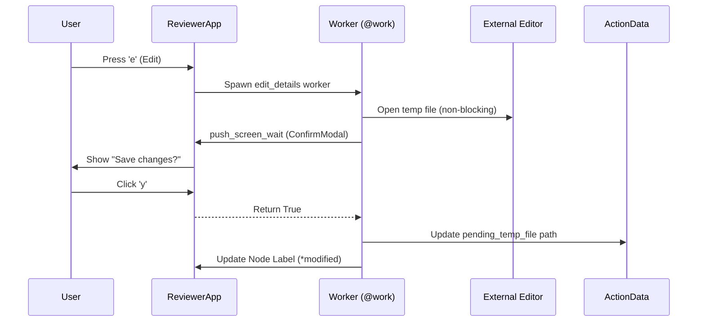

# Slice 00-04: TUI UX Polish and Refinements
- **Status:** Planned
- **Milestone:** [Milestone 10: Interactive Session Workflow & LLM Integration](/docs/project/milestones/10-interactive-session-and-config.md)
- **Prototype:** [prototypes/tui_deferred_harvest.py](/prototypes/tui_deferred_harvest.py)

## Business Goal
To refine the plan review TUI by implementing a more robust interaction model based on user feedback. The goal is to provide clear visual feedback for action status (pending, modified, executed) and a streamlined editing workflow that uses the user's external editor.

## Scenarios

### Scenario: Informative Header Display
> As a user, I want the header to show the plan's title and status, so I always have context for what I'm reviewing.

- **Given** a plan is loaded into the `ReviewerApp`.
- **When** the TUI is rendered.
- **Then** the `Header` widget MUST display the plan's title and status emoji in the center.
- **And** the `Header` widget MUST display a clock on the right.

#### Deliverables
- [✓] **Logic** - In `ReviewerApp.on_mount`, dynamically set `self.title` from `self.plan.title` and `self.plan.metadata["Status"]`.
- [✓] **Wiring** - In `ReviewerApp.compose`, the Header widget must be configured with `show_clock=True`.

### Scenario: Dual-Pane Layout with Comprehensive Parameter Inspection
> As a user, I want to see all available parameters for an action, including defaults, so I understand the full range of options.

- **Given** an action is highlighted in the `ActionTree`.
- **When** the `ParameterDetail` panel on the right is populated.
- **Then** it MUST display all possible parameters for that action type, showing the actual value if present, or the system's default value if not.
- **And** long parameters MUST wrap within the panel instead of causing horizontal scroll.

#### Deliverables
- [✓] **Logic** - Refactor `ReviewerApp.compose` to use a `Horizontal` layout (65/35 split).
- [✓] **Contract** - Replace `ParameterList(Tree)` with `ParameterDetail(ListView)` in `textual_plan_reviewer_widgets.py`.
- [✓] **Contract** - Implement `DetailItem(ListItem)` using a single `Label` for native text wrapping.
- [✓] **Logic** - Create a helper to resolve the full parameter set (including defaults) for any given `ActionType`.
- [ ] **Wiring** - Update `on_mount_logic` and `_update_detail_view` in `textual_plan_reviewer_logic.py` to populate `ParameterDetail`.
- [ ] **Wiring** - Implement `on_focus` in `ReviewerApp` to automatically highlight the first item in the list when the user tabs into the right pane.

### Scenario: Clean Visual Hierarchy
> As a user, I want to see a flat list of actions without expander icons, so the interface is clean and simple.

- **Given** the TUI is rendered.
- **When** the `ActionTree` is populated with actions.
- **Then** each action MUST be displayed as a leaf node without an expander icon.

#### Deliverables
- [✓] **Wiring** - In `ReviewerApp.on_mount`, use `tree.root.add_leaf` for each action.

### Scenario: Non-Blocking Deferred Editing (Deferred Harvest)
> As a user, I want my editor to open instantly and non-blockingly, so I can continue browsing the plan while I make changes.

- **Given** an action is highlighted in the `ActionTree`.
- **When** I press `e` (Edit).
- **Then** the system MUST launch the external editor without `--wait` and without suspending the TUI.
- **When** I click `(s) Submit`.
- **Then** the system MUST harvest (read) the content from all open temporary files and apply them to the plan before exiting.

#### Deliverables
- [ ] **Logic** - Refactor `ConsoleToolingHelper` to remove `--wait` and blocking heuristics for GUI editors.
- [✓] **Contract** - Add `pending_temp_file: Optional[str]` to `ActionData` to track temporary files for deferred harvesting.
- [ ] **Logic** - Implement branched editing in `action_edit_details`: Use `ParameterEditModal` for simple parameters and `launch_editor` (External) for content-heavy fields.
- [ ] **Logic** - Ensure `*modified` tag is applied as a suffix only after user confirmation.
- [ ] **Wiring** - Update `action_submit` to harvest any `pending_temp_file` content before deletion.

### Scenario: High-Density UI & Post-Execution Feedback
> As a user, I want a clear summary of actions in the tree and a detailed parameter view that shows defaults and execution results.

- **Given** the TUI is active.
- **Then** the `ActionTree` labels MUST be formatted as `TYPE: description`.
- **And** labels MUST be truncated to 60 characters.
- **When** an action has been executed.
- **Then** the `ParameterDetail` MUST display the `ActionLog`.

#### Deliverables
- [ ] **Logic** - Update `format_node_label` to use `TYPE: description` format and truncated messages.
- [ ] **Wiring** - Update `_update_detail_view` to render `ActionLog` if `action.executed` is true.
- [✓] **Logic** - Implement standardized `StatusBar` notification format: `[TIME] ACTION: STATUS - DETAIL`.
- [ ] **Logic** - Ensure manual execution of `PROMPT` triggers the "Reply in Editor" workflow.

### Scenario: Interactive `PROMPT` Action
> As a user, when I see a `PROMPT` action, I want to provide my answer directly within the TUI, so I don't have to be prompted again during execution.

- **Given** a `PROMPT` action is highlighted.
- **When** I press `e` (Edit).
- **Then** my external editor MUST open, populated with the AI's question.
- **And** the response MUST be stored with the action.

#### Deliverables
- [✓] **Logic** - Add case to `action_edit_details` for `PROMPT` action type.
- [✓] **Contract** - Extend `ActionData` in `plan.py` with `user_response: Optional[str] = None`.
- [✓] **Harness** - Add acceptance test for end-to-end response flow.

### Scenario: Comprehensive Toggling and Navigation
> As a user, I want to use standard, efficient keybindings to select and deselect actions for execution.

- **Given** the TUI is active.
- **When** I press `a` (toggle all).
- **Then** all actions MUST be toggled.
- **When** an action is highlighted and I press `space` or `enter`.
- **Then** its selection state MUST be toggled.

#### Deliverables
- [✓] **Logic** - Wire `(a)` key to `action_toggle_all`.
- [✓] **Wiring** - Add `space` keybinding to `ReviewerApp` for selection toggle.
- [✓] **Wiring** - `on_tree_node_selected` toggles selection.

### Scenario: Dynamic Footer & Full Plan Viewing
> As a user, I want a dynamic footer that shows only relevant actions, and an option to view the original plan file.

- **Given** the TUI is active.
- **When** I highlight a modified action.
- **Then** the `(r) Revert` binding MUST appear.
- **When** I press `v` (view plan).
- **Then** the original plan MUST open (read-only).

#### Deliverables
- [✓] **Logic** - Implement `ReviewerApp.check_action` for conditional `(r)` binding.
- [✓] **Wiring** - Wire `(v)` key to `action_view_plan`.

### Scenario: Step-by-Step Action Execution
> As a user, I want to execute actions one by one and see their real-time status.

- **Given** a plan is loaded.
- **When** I press `x` on a pending action.
- **Then** its label MUST change to `[RUNNING]` in blue.
- **When** it completes successfully.
- **Then** its label MUST change to `[SUCCESS]` in green.

#### Deliverables
- [✓] **Contract** - Add `RUNNING` state to `ExecutionStatus` enum.
- [✓] **Logic** - Refactor `action_execute_step` to be a `@work` worker.
- [✓] **Wiring** - Refactor `ExecutionOrchestrator` to support manual execution persistence.

## Delta Analysis
The following technical gaps were identified between the production code and the finalized prototype:

1. **Deadlock Risk:** The current TUI uses a custom `asyncio.Future` for `push_screen_wait` which deadlocks the event loop. Native Textual `@work` and `push_screen_wait` are required.
2. **Layout Inconsistency:** The production TUI still uses a `Tree` for parameters, which does not support the multi-line wrapping verified in the prototype's `ListView`.
3. **Execution Feedback:** The transition from `RUNNING` to `SUCCESS/FAILURE` requires asynchronous UI updates from a background thread to prevent UI freezing.

## Guidelines
- **Asynchrony:** ALL user-facing action handlers that invoke modals or external tools MUST be decorated with `@work`.
- **Consistency:** Use `anyio.to_thread.run_sync` for all blocking I/O (filesystem, subprocess) within workers.

### Prototype Supplement Notes
- **Focus Management:** Modals MUST explicitly call `.focus()` on their primary interactive widget in `on_mount`.
- **Safety:** Use `getattr(event, "control", None)` in focus handlers to avoid `AttributeError` when non-widget events fire.
- **Density:** Truncate labels in the `ActionTree` to 60 characters to avoid horizontal scrolling in the dual-pane view.

## Architectural Changes
- **`src/teddy_executor/core/domain/models/plan.py`**: Added `RUNNING` state and `pending_temp_file` / `user_response` fields.
- **`src/teddy_executor/adapters/inbound/textual_plan_reviewer.py`**: Refactored to use `@work` and dual-pane layout.
- **`src/teddy_executor/adapters/inbound/textual_plan_reviewer_widgets.py`**: Implemented `ParameterDetail(ListView)` and `StatusBar`.

## Interaction Sequence

## Implementation Notes
### Finalized Deliverables
- **Domain Expansion**: Added `pending_temp_file` and `user_response` to `ActionData`.
- **Status Bar**: Implemented `StatusBar` for real-time event logging.
- **Header Refinement**: Title and clock integration complete.

### Remaining Work
- **Deadlock Resolution**: Refactor `push_screen_wait` to use native Textual implementation in `textual_plan_reviewer.py`.
- **ListView Migration**: Complete the transition from `ParameterList(Tree)` to `ParameterDetail(ListView)`.
- **Deferred Harvest**: Finalize the `action_submit` logic to read from `pending_temp_file`.
