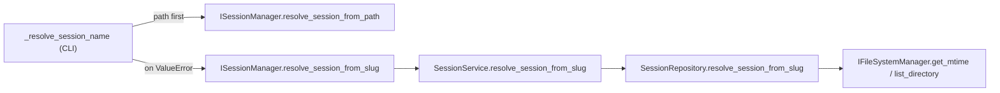

# Slice: resume-by-session-slug
- **Status:** In Progress
- **Milestone:** N/A (ad-hoc)
- **Specs:** N/A
- **Prototype:** N/A
- **Component Docs:**
  - [CLI Adapter (inbound)](../../architecture/adapters/inbound/cli.md)
  - [SessionService (core/services/session_service.md)](../../architecture/core/services/session_service.md)
  - [ISessionManager (core/ports/outbound/session_manager.md)](../../architecture/core/ports/outbound/session_manager.md)
- **Scope Slug:** `resume-session-slug`

## Business Goal
Allow `teddy resume <slug>` to resolve an existing session from its timestamp-stripped name (e.g. `teddy resume add-user-auth` → `.teddy/sessions/20260124_153000-add-user-auth`), so users no longer have to type or point at the full timestamped folder name. Resolution stays path-first and fully additive: existing path / CWD / auto-detect behavior is unchanged.

## Scenarios

> As a user, I want to resume a session by its short slug so that I don't have to type the full timestamped folder name.

```gherkin
Scenario: Resume by exact slug
  Given a session folder ".teddy/sessions/20260124_153000-add-user-auth" exists
  When the user runs "teddy resume add-user-auth"
  Then the CLI resolves the session to ".teddy/sessions/20260124_153000-add-user-auth"
```

> As a user, I want case-insensitive slug matching so that capitalization differences don't block me.

```gherkin
Scenario: Resume by case-insensitive slug
  Given a session folder ".teddy/sessions/20260124_153000-add-user-auth" exists
  When the user runs "teddy resume Add-User-Auth"
  Then the CLI resolves the session to ".teddy/sessions/20260124_153000-add-user-auth"
```

> As a user, I want the most recently modified session when a slug is ambiguous so that I resume the one I most likely mean.

```gherkin
Scenario: Ambiguous slug resolves latest-wins
  Given two session folders both strip to the slug "add-user-auth"
  And "20260125_090000-add-user-auth" is more recently modified than "20260124_153000-add-user-auth"
  When the user runs "teddy resume add-user-auth"
  Then the CLI resolves the session to "20260125_090000-add-user-auth"
```

> As a user, I want existing path-based resume behavior preserved so that my current workflows keep working unchanged.

```gherkin
Scenario: Path resolution still takes precedence
  Given a session folder ".teddy/sessions/20260124_153000-add-user-auth" exists
  When the user runs "teddy resume .teddy/sessions/20260124_153000-add-user-auth"
  Then the session is resolved via the path and slug resolution is never attempted
```

> As a user, I want a clear error when no session matches a slug so that I understand the failure.

```gherkin
Scenario: Unknown slug fails clearly
  Given no session folder strips to the slug "nonexistent-slug"
  When the user runs "teddy resume nonexistent-slug"
  Then the CLI fails with "No session found with slug: nonexistent-slug"
```

## Edge Cases
- **Case-insensitive exact match**: If the query differs from a session's stripped slug only by case, then it must match, in order to mirror the existing agent-name `casefold` convention.
- **Continuation folders excluded**: If a continuation folder such as `add-user-auth-2` exists, then a query of `add-user-auth` must NOT match it, because EXACT matching is required for this task.
- **Ambiguity is logged**: If several sessions share a slug, then the newest is chosen and a warning naming the chosen folder is logged, in order to keep the disambiguation auditable.
- **Missing sessions directory**: If `.teddy/sessions` does not exist (or lists no entries), then `ValueError("No sessions found.")` is raised, in order to fail fast with a clear message.
- **Unmatched slug**: If no folder's stripped slug equals the query, then `ValueError(f"No session found with slug: {slug}")` is raised, in order to surface a precise message.
- **Path takes precedence**: If path resolution succeeds, then slug resolution is never attempted, in order to preserve all existing path-based behavior.
- **Unreadable mtime**: If `get_mtime` raises `FileNotFoundError` or `OSError` for a candidate folder, then that candidate is skipped, mirroring `get_latest_session_name`.

## Key Unknowns
- [x] [Technical] Hand-written `ISessionRepository` double: the grep census found only autospec-based doubles (`mock_port`/`register_mock`) for `ISessionRepository`, which auto-tolerate additive protocol members — no migration required for the repository port. The `ISessionManager` hand-written `DummyManager` IS affected and is migrated atomically (Deliverable 2).
- [x] [Technical] `_strip_prefix` reuse: `SessionRepository._strip_prefix` already implements `re.sub(r"^\d{8}_\d{6}-", "", name)`; it is currently unused and will be reused rather than re-implemented.
- [x] [Technical] mtime source: `IFileSystemManager.get_mtime(path) -> float` exists and `SessionRepository` already holds `self._file_system_manager`; the mtime-sort pattern mirrors `get_latest_session_name`.

## Implementation Plan
Follows the existing Hexagonal convention (`port → service → repository`) established by `resolve_session_from_path`. No filesystem I/O is performed in the CLI adapter.

Green-to-green constraint: the `@runtime_checkable ISessionManager` protocol is validated by `assert isinstance(DummyManager(), ISessionManager)` in `test_session_manager_contract.py`, so adding a protocol member REQUIRES migrating the hand-written `DummyManager` in the SAME atomic commit (Deliverable 2). `ISessionRepository` is not `@runtime_checkable` and has no hand-written double, so its port addition is independently green (Deliverable 1).

Tracer Bullet Dependency Sequence:
1. **Contract** — declare the repository port member (Task Brief Step 1).
2. **Contract** — declare the manager protocol member + migrate the contract double (Steps 3 & 6, atomic).
3. **Logic** — implement the repository algorithm via TDD (Step 2 + Step 7).
4. **Seam** — delegate from the service (Step 4).
5. **Wiring** — overload the CLI `[path]` positional and prove the end-to-end path with an acceptance test (Step 5 + Step 9).
6. **Logic** — cover the CLI fallback edge cases with unit tests (Step 8).



## Deliverables
- [ ] **Contract** - Add `resolve_session_from_slug(self, slug: str) -> str` to the `ISessionRepository` outbound port (mirrors `resolve_session_from_path`); migrate a hand-written `ISessionRepository` double only if one exists (census says none does).
- [ ] **Contract** - Add `resolve_session_from_slug` to the `@runtime_checkable ISessionManager` protocol AND migrate the hand-written `DummyManager` contract double in the SAME atomic commit.
- [ ] **Logic** - Implement `SessionRepository.resolve_session_from_slug` (EXACT case-insensitive match via `_strip_prefix(...).casefold()`, LATEST-WINS mtime sort, `logger.warning` naming the chosen folder on ambiguity, `ValueError` on no-match/no-sessions) + the four repository unit tests.
- [ ] **Seam** - Implement the `SessionService.resolve_session_from_slug` delegate (`return self._repository.resolve_session_from_slug(slug)`) directly after `resolve_session_from_path`.
- [ ] **Wiring** - Overload the positional `[path]` in `_resolve_session_name`: try `resolve_session_from_path(path)` FIRST and fall back to `resolve_session_from_slug(path)` on `ValueError`; leave the no-`path` branch unchanged; add the end-to-end acceptance test (create a session → `teddy resume <slug>` resumes the correct folder).
- [ ] **Logic** - Add unit tests for the `_resolve_session_name` fallback (path-fails → slug fallback invoked; path-succeeds → slug fallback NOT invoked; no-`path` → CWD-climb/`get_latest_session_name` unchanged).

## Implementation Notes
_(Filled by the Developer as deliverables land.)_

## Verification
- [ ] `uv run pytest tests/suites/unit/core/services/test_session_repository.py -v` — all green.
- [ ] `uv run pytest tests/suites/unit/adapters/inbound/test_session_cli_handlers.py -v` — all green.
- [ ] `uv run pytest tests/suites/unit/core/ports/test_session_manager_contract.py -v` — contract double satisfies `isinstance`.
- [ ] `uv run pytest tests/suites/acceptance/test_session_resume_robustness.py -v` — all green.
- [ ] Manual: with a session folder `20260124_153000-add-user-auth`, `teddy resume add-user-auth` prints `Resuming session: .teddy/sessions/20260124_153000-add-user-auth`.
- [ ] Manual: `teddy resume` (no arg) and `teddy resume <valid path>` behave EXACTLY as before (no regression).
- [ ] Manual: `teddy resume nonexistent-slug` fails with a clear `ValueError` ("No session found with slug: nonexistent-slug").
- [ ] `uv run pytest` — full suite green (post-commit gate).
