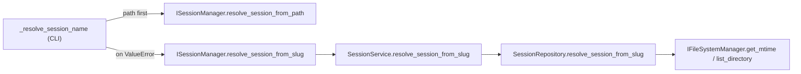

# Slice: resume-by-session-slug
- **Status:** In Progress
- **Milestone:** N/A (ad-hoc)
- **Specs:** N/A
- **Prototype:** N/A
- **Component Docs:**
  - [CLI Adapter (inbound)](../../architecture/adapters/inbound/cli.md)
  - [SessionService (core/services/session_service.md)](../../architecture/core/services/session_service.md)
  - [ISessionManager (core/ports/outbound/session_manager.md)](../../architecture/core/ports/outbound/session_manager.md)
- **Scope Slug:** `resume-session-slug`

## Business Goal
Allow `teddy resume <slug>` to resolve an existing session from its timestamp-stripped name (e.g. `teddy resume add-user-auth` → `.teddy/sessions/20260124_153000-add-user-auth`), so users no longer have to type or point at the full timestamped folder name. Resolution stays path-first and fully additive: existing path / CWD / auto-detect behavior is unchanged.

## Scenarios

> As a user, I want to resume a session by its short slug so that I don't have to type the full timestamped folder name.

```gherkin
Scenario: Resume by exact slug
  Given a session folder ".teddy/sessions/20260124_153000-add-user-auth" exists
  When the user runs "teddy resume add-user-auth"
  Then the CLI resolves the session to ".teddy/sessions/20260124_153000-add-user-auth"
```

> As a user, I want case-insensitive slug matching so that capitalization differences don't block me.

```gherkin
Scenario: Resume by case-insensitive slug
  Given a session folder ".teddy/sessions/20260124_153000-add-user-auth" exists
  When the user runs "teddy resume Add-User-Auth"
  Then the CLI resolves the session to ".teddy/sessions/20260124_153000-add-user-auth"
```

> As a user, I want the most recently modified session when a slug is ambiguous so that I resume the one I most likely mean.

```gherkin
Scenario: Ambiguous slug resolves latest-wins
  Given two session folders both strip to the slug "add-user-auth"
  And "20260125_090000-add-user-auth" is more recently modified than "20260124_153000-add-user-auth"
  When the user runs "teddy resume add-user-auth"
  Then the CLI resolves the session to "20260125_090000-add-user-auth"
```

> As a user, I want existing path-based resume behavior preserved so that my current workflows keep working unchanged.

```gherkin
Scenario: Path resolution still takes precedence
  Given a session folder ".teddy/sessions/20260124_153000-add-user-auth" exists
  When the user runs "teddy resume .teddy/sessions/20260124_153000-add-user-auth"
  Then the session is resolved via the path and slug resolution is never attempted
```

> As a user, I want a clear error when no session matches a slug so that I understand the failure.

```gherkin
Scenario: Unknown slug fails clearly
  Given no session folder strips to the slug "nonexistent-slug"
  When the user runs "teddy resume nonexistent-slug"
  Then the CLI fails with "No session found with slug: nonexistent-slug"
```

## Edge Cases
- **Case-insensitive exact match**: If the query differs from a session's stripped slug only by case, then it must match, in order to mirror the existing agent-name `casefold` convention.
- **Continuation folders excluded**: If a continuation folder such as `add-user-auth-2` exists, then a query of `add-user-auth` must NOT match it, because EXACT matching is required for this task.
- **Ambiguity is logged**: If several sessions share a slug, then the newest is chosen and a warning naming the chosen folder is logged, in order to keep the disambiguation auditable.
- **Missing sessions directory**: If `.teddy/sessions` does not exist (or lists no entries), then `ValueError("No sessions found.")` is raised, in order to fail fast with a clear message.
- **Unmatched slug**: If no folder's stripped slug equals the query, then `ValueError(f"No session found with slug: {slug}")` is raised, in order to surface a precise message.
- **Path takes precedence**: If path resolution succeeds, then slug resolution is never attempted, in order to preserve all existing path-based behavior.
- **Unreadable mtime**: If `get_mtime` raises `FileNotFoundError` or `OSError` for a candidate folder, then that candidate is skipped, mirroring `get_latest_session_name`.

## Key Unknowns
- [x] [Technical] Hand-written `ISessionRepository` double: the grep census found only autospec-based doubles (`mock_port`/`register_mock`) for `ISessionRepository`, which auto-tolerate additive protocol members — no migration required for the repository port. The `ISessionManager` hand-written `DummyManager` IS affected and is migrated atomically (Deliverable 2).
- [x] [Technical] `_strip_prefix` reuse: `SessionRepository._strip_prefix` already implements `re.sub(r"^\d{8}_\d{6}-", "", name)`; it is currently unused and will be reused rather than re-implemented.
- [x] [Technical] mtime source: `IFileSystemManager.get_mtime(path) -> float` exists and `SessionRepository` already holds `self._file_system_manager`; the mtime-sort pattern mirrors `get_latest_session_name`.

## Implementation Plan
Follows the existing Hexagonal convention (`port → service → repository`) established by `resolve_session_from_path`. No filesystem I/O is performed in the CLI adapter.

Green-to-green constraint: the `@runtime_checkable ISessionManager` protocol is validated by `assert isinstance(DummyManager(), ISessionManager)` in `test_session_manager_contract.py`, so adding a protocol member REQUIRES migrating the hand-written `DummyManager` in the SAME atomic commit (Deliverable 2). `ISessionRepository` is not `@runtime_checkable` and has no hand-written double, so its port addition is independently green (Deliverable 1).

Tracer Bullet Dependency Sequence:
1. **Contract** — declare the repository port member (Task Brief Step 1).
2. **Contract** — declare the manager protocol member + migrate the contract double (Steps 3 & 6, atomic).
3. **Logic** — implement the repository algorithm via TDD (Step 2 + Step 7).
4. **Seam** — delegate from the service (Step 4).
5. **Wiring** — overload the CLI `[path]` positional and prove the end-to-end path with an acceptance test (Step 5 + Step 9).
6. **Logic** — cover the CLI fallback edge cases with unit tests (Step 8).



## Deliverables
- [x] **Contract** - Add `resolve_session_from_slug(self, slug: str) -> str` to the `ISessionRepository` outbound port (mirrors `resolve_session_from_path`); migrate a hand-written `ISessionRepository` double only if one exists (census says none does).
- [x] **Contract** - Add `resolve_session_from_slug` to the `@runtime_checkable ISessionManager` protocol AND migrate the hand-written `DummyManager` contract double in the SAME atomic commit.
- [x] **Logic** - Implement `SessionRepository.resolve_session_from_slug` (EXACT case-insensitive match via `_strip_prefix(...).casefold()`, LATEST-WINS mtime sort, `logger.warning` naming the chosen folder on ambiguity, `ValueError` on no-match/no-sessions) + the four repository unit tests.
- [x] **Seam** - Implement the `SessionService.resolve_session_from_slug` delegate (`return self._repository.resolve_session_from_slug(slug)`) directly after `resolve_session_from_path`.
- [x] **Wiring** - Overload the positional `[path]` in `_resolve_session_name`: try `resolve_session_from_path(path)` FIRST and fall back to `resolve_session_from_slug(path)` on `ValueError`; leave the no-`path` branch unchanged; add the end-to-end acceptance test (create a session → `teddy resume <slug>` resumes the correct folder).
- [ ] **Logic** - Add unit tests for the `_resolve_session_name` fallback (path-fails → slug fallback invoked; path-succeeds → slug fallback NOT invoked; no-`path` → CWD-climb/`get_latest_session_name` unchanged).

## Implementation Notes

### Contract — `resolve_session_from_slug` on `ISessionRepository`

- **Change:** Declared the additive `resolve_session_from_slug(self, slug: str) -> str` member on the `ISessionRepository` outbound port ([session_repository.py](/src/teddy_executor/core/ports/outbound/session_repository.py)), placed directly after `resolve_session_from_path` and mirroring its shape/docstring. Signature matches the Task Brief (Step 1).
- **Test:** Added a Unit-layer contract-presence assertion at [test_session_repository_contract.py](/tests/suites/unit/core/ports/outbound/test_session_repository_contract.py) (`assert hasattr(ISessionRepository, "resolve_session_from_slug")`).
- **Cycle:** Red → Green → Refactor. Red confirmed `AssertionError: ISessionRepository must declare resolve_session_from_slug` (hasattr False). Green flipped to `1 passed` after the port declaration. Refactor was a deliberate no-op — a pure additive Protocol type declaration has no internal structure to restructure.
- **Green-to-green safety:** The Plan Audit confirmed `ISessionRepository` is NOT `@runtime_checkable` and has no hand-written double (only autospec-based `mock_port`/`register_mock` doubles exist, which auto-tolerate additive protocol members), so nothing could break. Integration gate: full suite green at `1641 passed, 5 skipped`.
- **Harness migration:** None required — the census found no hand-written `ISessionRepository` double.

### Contract — `resolve_session_from_slug` on `ISessionManager` (+ `DummyManager` migration)

- **Change:** Declared the additive `resolve_session_from_slug(self, slug: str) -> str` member on the `@runtime_checkable ISessionManager` protocol ([session_manager.py](/src/teddy_executor/core/ports/outbound/session_manager.py)), placed directly after `resolve_session_from_path` and mirroring its shape/docstring. Signature matches the Task Brief (Step 3).
- **Harness migration (mandatory, atomic):** Migrated the hand-written `DummyManager` double in [test_session_manager_contract.py](/tests/suites/unit/core/ports/test_session_manager_contract.py) with a matching no-op `resolve_session_from_slug` stub, placed directly after its `resolve_session_from_path` stub. This is REQUIRED because `@runtime_checkable ISessionManager` is enforced at runtime by `assert isinstance(DummyManager(), ISessionManager)` — adding the protocol member WITHOUT the stub would flip that pre-existing assertion to FAILED.
- **Test:** Added a Unit-layer contract-presence assertion at [test_session_manager_contract.py](/tests/suites/unit/core/ports/test_session_manager_contract.py) (`assert hasattr(ISessionManager, "resolve_session_from_slug")`), mirroring the Deliverable 1 idiom.
- **Cycle:** Red → Green → Refactor. Red confirmed `AssertionError: ISessionManager must declare resolve_session_from_slug` (hasattr False) while the two pre-existing tests stayed green (`1 failed, 2 passed`). Green flipped the suite to `3 passed` after the protocol member and the `DummyManager` stub landed together. Refactor was a deliberate no-op — one additive Protocol member plus its paired test-double stub have no internal structure to restructure.
- **Green-to-green safety:** The protocol member and its double were added in the SAME atomic edit set, satisfying the `isinstance` contract. Integration gate: full suite green at `1642 passed, 5 skipped`.

### Logic — `SessionRepository.resolve_session_from_slug`

- **Change:** Added `import logging` + a module-level `logger = logging.getLogger(__name__)` to [session_repository.py](/src/teddy_executor/core/services/session_repository.py) and implemented `resolve_session_from_slug(self, slug: str) -> str` directly after `resolve_session_from_path` (Task Brief Step 2). The algorithm reuses the pre-existing `_strip_prefix` helper (no regex re-implementation) and mirrors the `get_latest_session_name` pattern: `.teddy/sessions` existence check → `ValueError("No sessions found.")`; list the root → keep names whose `_strip_prefix(name).casefold()` equals `slug.strip().casefold()` (EXACT, case-insensitive); score each match by `get_mtime` (skipping `FileNotFoundError`/`OSError`); sort descending and return the newest (LATEST-WINS); emit a `logger.warning` naming the chosen folder when more than one match; raise `ValueError(f"No session found with slug: {slug}")` on no match.
- **Tests:** Added five Unit-layer tests to [test_session_repository.py](/tests/suites/unit/core/services/test_session_repository.py): happy path (`test_resolve_session_from_slug_matches_stripped_prefix`), case-insensitivity (`test_resolve_session_from_slug_is_case_insensitive`), latest-wins on ambiguity (`test_resolve_session_from_slug_latest_wins_on_ambiguity`), no-match `ValueError` (`test_resolve_session_from_slug_raises_when_no_match`), and no-sessions `ValueError` (`test_resolve_session_from_slug_raises_when_no_sessions`). All use the file's existing `create_autospec(IFileSystemManager, instance=True)` idiom; the ambiguity test uses list-based `get_mtime.side_effect` (no path-argument inspection, so no Windows `to_posix_path` normalization concern).
- **Cycle:** Red → Green → Refactor. Red confirmed `AssertionError: assert None == '20260124_153000-add-user-auth'` (the un-overridden protocol body returned `None`); Green flipped the happy-path test to `1 passed` after `import logging` + `logger` + the implementation; the four edge-case tests then landed green-on-write over branches the algorithm already implemented, closing the repository suite at `9 passed`. Refactor was a deliberate no-op — the method mirrors (rather than copies) the `get_latest_session_name` mtime-sort pattern and introduces no magic numbers or shared harness logic to extract.
- **Green-to-green safety:** No existing `SessionRepository` method body was altered; the change is purely additive (a module `logger` + one new method) and reuses the already-present `_strip_prefix` helper. Integration gate: full suite green at `1647 passed, 5 skipped`.

### Seam — `SessionService.resolve_session_from_slug` Delegate

- **Change:** Added `resolve_session_from_slug(self, slug: str) -> str` to [session_service.py](/src/teddy_executor/core/services/session_service.py) directly after `resolve_session_from_path` (before `set_session_agent`) per Task Brief Step 4. The body is a one-line delegate: `return self._repository.resolve_session_from_slug(slug)` — no filesystem I/O in the CLI adapter, mirroring the sibling `resolve_session_from_path` delegate.
- **Tests:** Added a focused Unit-layer delegate test at [test_session_service_slug_delegation.py](/tests/suites/unit/core/services/test_session_service_slug_delegation.py) (`test_resolve_session_from_slug_delegates_to_repository`) using the established `env.mock_port(ISessionRepository)` + `env.get_service(ISessionManager)` idiom (Anti-Mock Poisoning: bound, autospec-based double injected via constructor); it asserts the slug is forwarded verbatim (`assert_called_once_with("add-user-auth")`) and the repository's answer is returned.
- **Cycle:** Red → Green → Refactor. Red confirmed `AssertionError: Expected 'resolve_session_from_slug' to be called once. Called 0 times.` (the inherited `ISessionManager` protocol stub returned `None` without touching the repository); Green flipped to `1 passed` after the one-line delegate landed. Refactor was a deliberate no-op — a one-line delegate mirroring an existing sibling has no duplicated logic, magic numbers, or shared harness logic to extract.
- **Green-to-green safety:** No existing `SessionService` method body was altered; the change is purely additive (one new delegate method) and reuses the `SessionRepository` implementation from Deliverable 3. Integration gate: full suite green at `1648 passed, 5 skipped`.

### Wiring — CLI `_resolve_session_name` Slug Fallback

- **Change:** Overloaded the positional `[path]` in `_resolve_session_name` ([session_cli_handlers.py](/src/teddy_executor/adapters/inbound/session_cli_handlers.py)); the `if path:` arm now tries `session_manager.resolve_session_from_path(path)` FIRST and, ONLY on `ValueError`, falls back to `session_manager.resolve_session_from_slug(path)` per Task Brief Step 5. The no-`path` arm (CWD-climb → `get_latest_session_name()`) is left UNCHANGED, and the docstring was updated to mention the slug fallback. No filesystem I/O is introduced in the CLI adapter (port → service → repository).
- **Tests:** Added the end-to-end acceptance test `test_resume_by_slug_resolves_timestamped_session` at [test_session_resume_robustness.py](/tests/suites/acceptance/test_session_resume_robustness.py) (Task Brief Step 9): it creates a session via `start add-user-auth` (fixed clock → folder `20260417_120000-add-user-auth`) and resumes it via `resume add-user-auth`, then asserts exit 0 and that the resolved timestamped folder name surfaces on stdout.
- **Cycle:** Red → Green → Refactor. Red confirmed `AssertionError: assert 1 == 0` (`Result SystemExit(1).exit_code`) — with no fallback, a bare slug raised `ValueError` and `handle_resume_session` exited 1; Green flipped to `1 passed` after wiring the `try/except ValueError` fallback. Refactor was a deliberate no-op — the fallback reuses the existing `try/except ValueError` idiom already present in the sibling no-`path` arm.
- **Green-to-green safety:** The change is scoped to the `if path:` arm and preserves all existing path/CWD/auto-detect resume behavior (the CLI still tries `resolve_session_from_path` first). Integration gate: full suite green at `1649 passed, 5 skipped`.

## Verification
- [ ] `uv run pytest tests/suites/unit/core/services/test_session_repository.py -v` — all green.
- [ ] `uv run pytest tests/suites/unit/adapters/inbound/test_session_cli_handlers.py -v` — all green.
- [ ] `uv run pytest tests/suites/unit/core/ports/test_session_manager_contract.py -v` — contract double satisfies `isinstance`.
- [ ] `uv run pytest tests/suites/acceptance/test_session_resume_robustness.py -v` — all green.
- [ ] Manual: with a session folder `20260124_153000-add-user-auth`, `teddy resume add-user-auth` prints `Resuming session: .teddy/sessions/20260124_153000-add-user-auth`.
- [ ] Manual: `teddy resume` (no arg) and `teddy resume <valid path>` behave EXACTLY as before (no regression).
- [ ] Manual: `teddy resume nonexistent-slug` fails with a clear `ValueError` ("No session found with slug: nonexistent-slug").
- [ ] `uv run pytest` — full suite green (post-commit gate).
