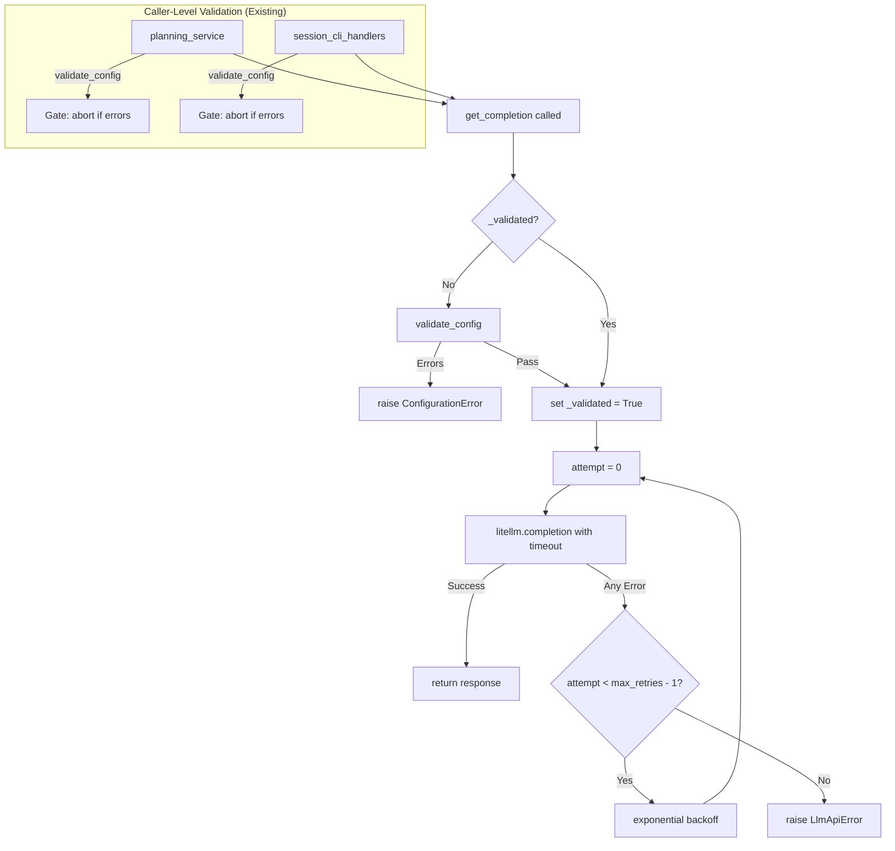

# Slice: Config Validation & Transient Retry
- **Status:** To De-risk
- **Type:** Feature
- **Milestone:** [docs/project/milestones/02-stability-and-polish.md](/docs/project/milestones/02-stability-and-polish.md)
- **Specs:** [docs/project/specs/stability-and-bugfixes.md](/docs/project/specs/stability-and-bugfixes.md)
- **Component Docs:** [docs/architecture/adapters/outbound/litellm_adapter.md](/docs/architecture/adapters/outbound/litellm_adapter.md)

## Business Goal
To harden the LLM integration against configuration errors and transient failures. Before any AI call, validate that the LLM configuration (API key, model, provider) is valid — failing fast with a clear fatal error if misconfigured. Once validated, treat all subsequent completion errors as transient and retry them with exponential backoff, eliminating the current behavior where non-SSL/timeout errors fail on the first attempt.

## Scenarios

> As a user, I want invalid LLM configuration to be caught immediately at the first AI call so that I get a clear error message instead of mysterious failures during plan generation.

```gherkin
Feature: Startup Config Validation
  Scenario: Invalid API key is caught before first completion
    Given the configured llm.api_key is empty
    When I call get_completion for the first time
    Then a ConfigurationError is raised immediately
    And no litellm.completion call is made
    And the error message mentions the API key

  Scenario: Missing model is caught before first completion
    Given the configured llm.model is null or empty
    When I call get_completion for the first time
    Then a fatal error is raised immediately
    And no litellm.completion call is made
```

> As a user, I want transient LLM errors to be automatically retried so that temporary network or server issues don't cause an abrupt session termination.

```gherkin
Feature: Transient Retry on All Errors
  Scenario: Any error during completion is retried after config validation passed
    Given config validation has already passed on a previous call
    When litellm.completion raises an arbitrary Exception (not SSL/Timeout specific)
    Then the adapter retries the call up to max_retries times
    And exponential backoff is applied between retries
    And if all retries fail, an LlmApiError is raised

  Scenario: Successful retry recovers from transient failure
    Given config validation has already passed
    When the first litellm.completion call raises an arbitrary Exception
    And the second call succeeds
    Then get_completion returns the successful response
    And no error is raised

  Scenario: SSL errors are still retried with existing backoff
    Given config validation has already passed
    When litellm.completion raises SSLV3_ALERT_BAD_RECORD_MAC
    Then the adapter retries with exponential backoff
    And the behavior matches the existing SSL retry logic
```

> As a user, I want to configure a timeout for LLM completion calls so that slow responses don't hang the system indefinitely.

```gherkin
Feature: Configurable Completion Timeout
  Scenario: Default timeout is passed to litellm when no timeout is configured
    Given no timeout is set in the llm config section
    When get_completion is called
    Then litellm.completion receives the default timeout of 300 seconds
    And the request does not hang indefinitely

  Scenario: Custom timeout in config.yaml is passed to litellm
    Given llm.timeout is set to 600 in config.yaml
    When get_completion is called
    Then litellm.completion receives timeout=600

  Scenario: Timeout expires and triggers retry
    Given config validation has already passed
    And llm.timeout is set to 1 second
    When litellm.completion raises a timeout exception
    Then the adapter retries the call
    And the timeout parameter is passed again on retry
```

## Edge Cases

- **Config validation called once**: validate_config MUST only be called on the first invocation of get_completion. Subsequent calls must skip validation to avoid redundant checks. Use a boolean flag `_validated`.
- **Config validation passes with no issues**: If validate_config returns an empty list, execution proceeds normally. No ConfigurationError is raised.
- **Config validation passes but remote check fails**: If `include_remote=True` is used and the remote key check times out or fails, this should be logged as an error but not block completion — the remote check is advisory.
- **Retry exhaustion still raises LlmApiError**: After all max_attempts are exhausted, the original exception message is preserved in the LlmApiError.
- **Max retries is 1**: If max_retries is explicitly set to 1, only one attempt is made. This should not cause infinite loops or division by zero in backoff calculation.
- **Zero timeout means no timeout**: If timeout is explicitly set to 0 or None, litellm uses its own default (no timeout). The configuration should not force a timeout of 0 which would immediately fail.
- **Concurrent calls to get_completion**: If two threads call get_completion simultaneously, the validation flag check must be thread-safe. Use a lock around the validation check (similar to existing `_init_lock` pattern).
- **validate_config already exists as dead code**: The method `validate_config()` is implemented in LiteLLMAdapter but never called. The slice must add the call to it, not reimplement it. However, the current implementation should be reviewed — it already handles empty API key, missing model, and missing env vars.

## Deliverables

- [ ] **Contract** - Add `timeout: 300` to the `llm` section in `src/teddy_executor/resources/config/config.yaml` baseline, establishing the default timeout of 5 minutes for all LLM completion calls.
- [ ] **Harness** - Create/update test harness utilities for simulating `validate_config` return values (empty list = pass, non-empty = fail) in unit tests. The existing `register_mock` pattern should be sufficient for ILlmClient mock setup.
- [ ] **Logic** - Implement the lazy startup validation in `get_completion()`: add a `_validated` flag and call `validate_config()` on first invocation, raising `ConfigurationError` immediately if validation fails. Modify `_should_retry_completion()` to retry on ALL exceptions (not just SSL/Timeout) when config validation has passed. Bundle unit tests covering: validation pass/fail, retry-all-errors, successful retry recovery, and thread safety.
- [ ] **Logic** - Update `_prepare_completion_params()` or the retry loop to ensure the `timeout` parameter from config is properly passed to litellm. If no timeout is configured, default to 300. Bundle unit tests covering timeout passthrough and timeout-triggers-retry.
- [ ] **Wiring** - Integration test verifying the full validation-then-retry flow: mock config to pass validation, make litellm fail with a generic error, verify retries occur, then make it succeed on retry 2, verify successful response returned.

## Implementation Notes

*(To be filled by Developer during implementation.)*

## Implementation Plan

### Strategy
The changes are tightly scoped to `LiteLLMAdapter` and `config.yaml`. No port or contract changes are needed — `ILlmClient` already defines `validate_config()` and the config layering mechanism already passes all `llm` keys to litellm.

**Key Finding (Impact Audit):** `validate_config()` is NOT dead code. It is already called by two production consumers:
- `session_cli_handlers.py:169` — during session startup/init
- `planning_service.py:169` — before plan generation

This means the primary validation gate already exists at the caller level. The `_validated` flag in `get_completion()` is a **defense-in-depth** layer — it ensures that even if a new code path calls `get_completion()` directly without prior validation, the config is checked. The core behavioral change is: **after config validation has passed (either by external callers or by the internal guard), retry on ALL errors**, not just SSL/Timeout.

### Test Harness Triad Strategy
- **Setup:** Use `register_mock(container, IConfigService)` to control config values. Use `POSIXPathMock` for the internal litellm provider (existing pattern in `test_litellm_adapter_retries.py`). Set side_effect on `mock_config.get_setting` to control validation outcomes.
- **Driver:** Call `LiteLLMAdapter.get_completion()` directly with the mocked dependencies.
- **Observer:** Assert on: (a) `mock_litellm.completion.call_count` for retry counts, (b) raised exceptions for validation failures, (c) call args for timeout passthrough.

### Key Implementation Details
1. **Validation Guard (Defense-in-Depth):** Add a `_validated: bool = False` flag (with `_init_lock` for thread safety) to `LiteLLMAdapter.__init__`. In `get_completion()`, before the retry loop, check and set this flag. If `validate_config()` returns errors, raise `ConfigurationError` immediately. This ensures safety even if `get_completion()` is called directly without external validation.
2. **Retry Logic Change:** The core behavioral change. In `get_completion()`, after config validation has passed (either via the internal guard or because external callers already validated), retry on ALL errors. Modify `_should_retry_completion()` to remove the `is_transient` filter — since validation has passed, any error during completion is assumed transient. Use `attempt < max_attempts - 1` as the sole condition, keeping the exponential backoff.
3. **Timeout Passthrough:** In `_prepare_completion_params()`, ensure `timeout` from config is resolved with a fallback to 300. Currently, `params.update(llm_config)` handles this automatically — just verify the default exists in config.yaml.

### Mermaid Flow

