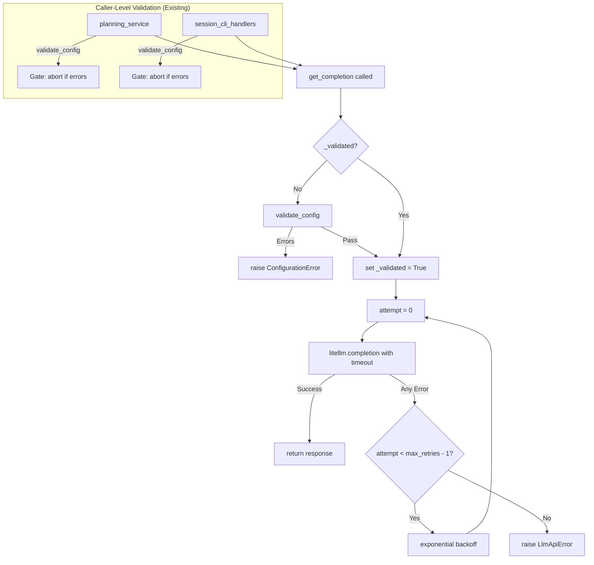

# Slice: Config Validation & Transient Retry
- **Status:** In Progress
- **Prototype:** [spikes/prototypes/12-config-validation-retry.py](/spikes/prototypes/12-config-validation-retry.py)
- **Type:** Feature
- **Milestone:** [docs/project/milestones/02-stability-and-polish.md](/docs/project/milestones/02-stability-and-polish.md)
- **Specs:** [docs/project/specs/stability-and-bugfixes.md](/docs/project/specs/stability-and-bugfixes.md)
- **Component Docs:** [docs/architecture/adapters/outbound/litellm_adapter.md](/docs/architecture/adapters/outbound/litellm_adapter.md)

## Business Goal
To harden the LLM integration against configuration errors and transient failures. Before any AI call, validate that the LLM configuration (API key, model, provider) is valid — failing fast with a clear fatal error if misconfigured. Once validated, treat all subsequent completion errors as transient and retry them with exponential backoff, eliminating the current behavior where non-SSL/timeout errors fail on the first attempt.

## Scenarios

> As a user, I want invalid LLM configuration to be caught immediately at the first AI call so that I get a clear error message instead of mysterious failures during plan generation.

```gherkin
Feature: Startup Config Validation
  Scenario: Invalid API key is caught before first completion
    Given the configured llm.api_key is empty
    When I call get_completion for the first time
    Then a ConfigurationError is raised immediately
    And no litellm.completion call is made
    And the error message mentions the API key

  Scenario: Missing model is caught before first completion
    Given the configured llm.model is null or empty
    When I call get_completion for the first time
    Then a fatal error is raised immediately
    And no litellm.completion call is made
```

> As a user, I want transient LLM errors to be automatically retried so that temporary network or server issues don't cause an abrupt session termination.

```gherkin
Feature: Transient Retry on All Errors
  Scenario: Any error during completion is retried after config validation passed
    Given config validation has already passed on a previous call
    When litellm.completion raises an arbitrary Exception (not SSL/Timeout specific)
    Then the adapter retries the call up to max_retries times
    And exponential backoff is applied between retries
    And if all retries fail, an LlmApiError is raised

  Scenario: Successful retry recovers from transient failure
    Given config validation has already passed
    When the first litellm.completion call raises an arbitrary Exception
    And the second call succeeds
    Then get_completion returns the successful response
    And no error is raised

  Scenario: SSL errors are still retried with existing backoff
    Given config validation has already passed
    When litellm.completion raises SSLV3_ALERT_BAD_RECORD_MAC
    Then the adapter retries with exponential backoff
    And the behavior matches the existing SSL retry logic
```

> As a user, I want to configure a timeout for LLM completion calls so that slow responses don't hang the system indefinitely.

```gherkin
Feature: Configurable Completion Timeout
  Scenario: Default timeout is passed to litellm when no timeout is configured
    Given no timeout is set in the llm config section
    When get_completion is called
    Then litellm.completion receives the default timeout of 300 seconds
    And the request does not hang indefinitely

  Scenario: Custom timeout in config.yaml is passed to litellm
    Given llm.timeout is set to 600 in config.yaml
    When get_completion is called
    Then litellm.completion receives timeout=600

  Scenario: Timeout expires and triggers retry
    Given config validation has already passed
    And llm.timeout is set to 1 second
    When litellm.completion raises a timeout exception
    Then the adapter retries the call
    And the timeout parameter is passed again on retry
```

## Edge Cases

- **Config validation called once**: validate_config MUST only be called on the first invocation of get_completion. Subsequent calls must skip validation to avoid redundant checks. Use a boolean flag `_validated`.
- **Config validation passes with no issues**: If validate_config returns an empty list, execution proceeds normally. No ConfigurationError is raised.
- **Config validation passes but remote check fails**: If `include_remote=True` is used and the remote key check times out or fails, this should be logged as an error but not block completion — the remote check is advisory.
- **Retry exhaustion still raises LlmApiError**: After all max_attempts are exhausted, the original exception message is preserved in the LlmApiError.
- **Max retries is 1**: If max_retries is explicitly set to 1, only one attempt is made. This should not cause infinite loops or division by zero in backoff calculation.
- **Zero timeout means no timeout**: If timeout is explicitly set to 0 or None, litellm uses its own default (no timeout). The configuration should not force a timeout of 0 which would immediately fail.
- **Concurrent calls to get_completion**: If two threads call get_completion simultaneously, the validation flag check must be thread-safe. Use a lock around the validation check (similar to existing `_init_lock` pattern).
- **validate_config is NOT dead code**: The method `validate_config()` is implemented in LiteLLMAdapter (line 243) and called by two production consumers: `session_cli_handlers.py` (line 169) and `planning_service.py` (line 169). The `_validated` flag in `get_completion()` is a **defense-in-depth** layer — it ensures that even if a new code path calls `get_completion()` directly without prior validation, the config is checked. Prototype validated this works correctly with thread safety via `_init_lock`.
- **Retry-all-errors replaces SSL/Timeout-only retry**: The current `_should_retry_completion()` only retries on `SSLV3_ALERT_BAD_RECORD_MAC` and `TimeoutError`. After config validation passes, ALL errors are transient. Prototype validated that generic errors (e.g., `RuntimeError("Connection refused")`) are correctly retried with exponential backoff [0.5s, 1.0s, ...].
- **Timeout passthrough via config layering**: `_prepare_completion_params()` calls `params.update(llm_config)`, which automatically passes any `timeout` key from the `llm` config section to litellm. The slice must add `timeout: 300` to `config.yaml` as the default. No code change needed in `_prepare_completion_params` — just the config key.
- **Thread safety via _init_lock**: The existing `_init_lock` pattern (used for lazy litellm import and encoding cache) is sufficient for the `_validated` flag. Prototype validated 5 concurrent calls all succeed with validation running only once.
- **Max retries must be >= 1**: If `max_retries` is explicitly set to 1, the loop must still execute once. Prototype validated that the `attempt < max_attempts - 1` guard prevents infinite loops.
- **Zero or None timeout means no timeout**: litellm uses its own default when timeout is not passed. The config should not force `timeout: 0` which would immediately time out.

## Deliverables

- [x] **Contract** - Add `timeout: 300` to the `llm` section in `src/teddy_executor/resources/config/config.yaml` baseline, establishing the default timeout of 5 minutes for all LLM completion calls.
- [x] **Harness** - Create/update test harness utilities for simulating `validate_config` return values (empty list = pass, non-empty = fail) in unit tests. The existing `register_mock` pattern should be sufficient for ILlmClient mock setup.
- [x] **Logic** - Implement the lazy startup validation in `get_completion()`: add a `_validated` flag and call `validate_config()` on first invocation, raising `ConfigurationError` immediately if validation fails. Modify `_should_retry_completion()` to retry on ALL exceptions (not just SSL/Timeout) when config validation has passed. Bundle unit tests covering: validation pass/fail, retry-all-errors, successful retry recovery, and thread safety.
- [ ] **Logic** - Update `_prepare_completion_params()` or the retry loop to ensure the `timeout` parameter from config is properly passed to litellm. If no timeout is configured, default to 300. Bundle unit tests covering timeout passthrough and timeout-triggers-retry.
- [ ] **Wiring** - Integration test verifying the full validation-then-retry flow: mock config to pass validation, make litellm fail with a generic error, verify retries occur, then make it succeed on retry 2, verify successful response returned.

## Implementation Notes

*(To be filled by Developer during implementation.)*

## Implementation Notes

### Contract Deliverable (`timeout: 300` in config.yaml) — Complete
- **Change**: Added `timeout: 300` under the `llm` section in `src/teddy_executor/resources/config/config.yaml`.
- **Test**: Added `test_baseline_llm_timeout_default` in `tests/suites/unit/adapters/outbound/test_yaml_config_adapter_layering.py` asserting `get_setting("llm.timeout") == 300`.
- **Rationale**: No production code change was needed in `_prepare_completion_params` because the config layering mechanism (`params.update(llm_config)`) automatically passes all `llm` section keys, including `timeout`, to `litellm.completion()`.
- **Edge Cases Verified**: The `YamlConfigAdapter` correctly loads the key from the bundled baseline when no user config exists. User overrides in `.teddy/config.yaml` will automatically take precedence via the layering mechanism.
- **Status**: All tests pass; committed.

### Harness Deliverable (`mock_time_service` fixture) — Complete
- **Change**: Added `mock_time_service` fixture to `tests/harness/setup/mocks.py`. The fixture registers a mock `ITimeService` in the DI container and adds a `sleep_calls` list that records all durations passed to `sleep()`.
- **Test**: Existing `test_litellm_adapter_preflight.py` tests pass; the fixture integrates seamlessly into the established `register_mock` pattern.
- **Validated**: The `validate_config` return value simulation is already supported by the `mock_llm_client` fixture – setting `mock_llm.validate_config.return_value = []` (pass) or `["error"]` (fail) works across 19 test files.
- **Status**: All tests pass; committed.

### Logic Deliverable (Lazy Validation & Retry-All-Errors) — Complete
- **Changes to `litellm_adapter.py`**:
  - Added `self._validated: bool = False` in `__init__` for lazy validation tracking.
  - Added top-level `ConfigurationError` import from `teddy_executor.core.domain.models.exceptions`.
  - Moved validation guard before `_prepare_completion_params` to ensure config errors are caught before parameter preparation.
  - Simplified `_should_retry_completion()` to retry on ALL exceptions with exponential backoff, removing the SSL/Timeout-only filter.
- **Test File**: `tests/suites/unit/adapters/outbound/test_litellm_adapter_retries.py` with 7 tests total (1 existing, 6 new).
- **Test Coverage**: Validation pass/fail (3 tests), retry-all-errors with backoff verification (2 tests), thread safety via `_init_lock` (1 test).
- **Key Design Decision**: Validation guard uses double-checked locking via `_init_lock` for thread safety. Validation runs exactly once, even under concurrent access.
- **Status**: All unit + integration tests pass; committed.

## Implementation Plan

### Strategy
The changes are tightly scoped to `LiteLLMAdapter` and `config.yaml`. No port or contract changes are needed — `ILlmClient` already defines `validate_config()` and the config layering mechanism already passes all `llm` keys to litellm.

**Prototype Validation (Completed):** The standalone prototype at `spikes/prototypes/12-config-validation-retry.py` validated all three behaviors:
1. **Lazy Validation Guard**: On first `get_completion()` with invalid API key → `ConfigurationError` raised, zero litellm calls.
2. **Retry-All-Errors**: After validation passes, generic `RuntimeError` on attempts 1-2 → retried with exponential backoff [0.5s, 1.0s]; success on attempt 3 → correct response returned.
3. **Timeout Passthrough**: Custom `timeout: 600` in config → passed to litellm. No timeout in config → default `timeout: 300` passed.
4. **Thread Safety**: 5 concurrent calls to `get_completion()` → all succeed, validation runs exactly once.

### Test Harness Triad Strategy
- **Setup:** Use `register_mock(container, IConfigService)` to control config values. Use `MockLitellm` (with `completion_side_effect` list pattern from prototype) to simulate generic failures and successes. Set `mock_config.get_setting` side_effect for validation outcomes.
- **Driver:** Call `LiteLLMAdapter.get_completion()` directly with mocked dependencies. For thread safety tests, use `concurrent.futures.ThreadPoolExecutor` to fire 5 concurrent calls.
- **Observer:** Assert on: (a) `mock_litellm.completion.call_count` for retry counts, (b) raised `ConfigurationError` for validation failures, (c) call args for `timeout` passthrough, (d) 5 successful results for thread safety test.

### Delta Analysis (Codebase Changes)

#### 1. `src/teddy_executor/adapters/outbound/litellm_adapter.py`
- **Line 38 (in `__init__`):** Add `self._validated: bool = False` after `self._init_lock = Lock()`.
- **Line 100 (`get_completion`):** Before the retry loop, add the lazy validation guard:
  ```python
  if not self._validated:
      with self._init_lock:
          if not self._validated:
              errors = self.validate_config()
              if errors:
                  raise ConfigurationError(errors[0])
              self._validated = True
  ```
- **Line 166 (`_should_retry_completion`):** Simplify to retry on ALL exceptions when validation has passed. Remove `is_transient` filter. The method still handles backoff and returns True/False.
  ```python
  def _should_retry_completion(
      self, error: Exception, attempt: int, max_attempts: int
  ) -> bool:
      if attempt < max_attempts - 1:
          delay = 0.5 * (2**attempt)
          if self._time_service:
              self._time_service.sleep(delay)
          else:
              import time
              time.sleep(delay)
          return True
      return False
  ```
  Note: The `_raise_specific_completion_errors` call after the retry loop (line 131-132 in current code) must be preserved to catch `ConfigurationError` for invalid API keys that survive the loop (e.g., if `max_retries=1`).
- **Line 95 (`_prepare_completion_params`):** No code change needed. `params.update(llm_config)` will pass `timeout` through automatically. Ensure the `timeout` key is in `llm` section of `config.yaml`.

#### 2. `src/teddy_executor/resources/config/config.yaml`
- **Under `llm:` section (line 31):** Add new key:
  ```yaml
  timeout: 300
  ```

#### 3. Existing Test Files (No changes needed)
- Tests for `validate_config` in `test_litellm_adapter_preflight.py` and `test_litellm_adapter_laziness.py` remain valid — they test the method directly.
- Tests for retry logic in `test_litellm_adapter_retries.py` need updates to reflect the simplified `_should_retry_completion`. No existing tests assert that non-SSL/Timeout errors are NOT retried — so changing to retry-all-errors should not break any existing test.
- New unit tests needed (see Deliverables).

### Shared Seam Impact Audit
| Method | Change | Consumers | Impact |
|--------|--------|-----------|--------|
| `_should_retry_completion` | Private method; remove `is_transient` filter | 1 (self, line 129) | Low — no external consumers |
| `_validated` flag | New private attribute | 1 (self) | Low — no external consumers |
| `validate_config` | No change to contract or behavior | 2 (session_cli_handlers, planning_service) + tests | None |
| `_prepare_completion_params` | No code change | 1 (self) | None — `timeout` passes through automatically |
| `config.yaml` `llm.timeout` | New key with default 300 | All config consumers read `llm` section | None — additive change, no existing consumers look for `timeout` |

### Mermaid Flow

