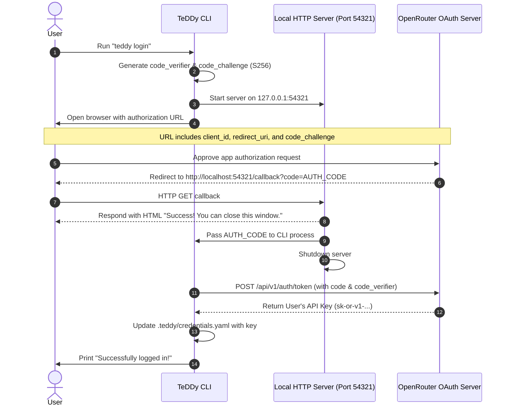

# Spec: OpenRouter OAuth Monetization

- **Status:** Active
- **Created Date:** 2026-05-20

## 1. Overview / Problem Statement

### The Goal
Provide a frictionless onboarding experience for new users of TeDDy while building a sustainable, native revenue model for the open-source project.

### The Friction
Currently, TeDDy requires manual configuration of raw API keys (like Gemini, OpenAI, or Anthropic) in `.teddy/config.yaml`. This introduces immediate friction for non-developer users and makes it difficult to monetize the usage directly without running complex proxy servers, databases, and credit-card billing mechanisms.

### The Solution
Integrate **OpenRouter OAuth (PKCE)**. This allows users to:
1. Authenticate with their OpenRouter wallet via a simple CLI command (`teddy login`).
2. Run any state-of-the-art coding model (Claude 3.5 Sonnet, GPT-4o, etc.) with zero key-management overhead.
3. Automatically support the open-source project by paying a small, transparent **Developer App Fee (markup)** configured on OpenRouter, which gets natively credited to the TeDDy developer wallet.

---

## 2. Key Architectural & Product Questions

### Persistence & OAuth Lifecycle (How will OAuth work in future sessions?)
- **Single-Login Persistence:** Users only need to log in once. OpenRouter OAuth-generated API keys do not expire unless manually revoked by the user inside their OpenRouter.ai developer settings.
- **Silent Reuse:** Once the authorization flow completes successfully, the resulting API key is written to a local credentials file (`.teddy/credentials.yaml`). TeDDy will reuse this credential silently and automatically for all future turns, commands, and sessions. The user never has to re-authenticate on the same machine.

### Secure Secret Storage (How is BYOK handled securely?)
- **Separation of Concerns:** Storing sensitive API keys directly inside `config.yaml` introduces the risk of users accidentally committing their credentials to Git (if they choose to track non-sensitive configuration parameters like `editor`, `ui_mode`, or `auto_pruning` to share with their team).
- **The Security Architecture:**
  1. **System Environment Variables:** TeDDy prioritizes standard environment variables (like `OPENAI_API_KEY`, `ANTHROPIC_API_KEY`, or `OPENROUTER_API_KEY`) above all else.
  2. **Dedicated Credentials File:** The login flow writes its retrieved key directly to `.teddy/credentials.yaml`. This file is strictly ignored by version control and acts solely as a local, machine-specific secret store.
  3. **Clean Configuration File:** `.teddy/config.yaml` only holds non-sensitive preferences (like UI modes, editors, and pruning policies) and can be safely shared or tracked.

---

## 3. Guiding Principles / Core Logic

- **Frictionless Onboarding:** A single command (`teddy login`) should spin up a local authentication server, open the browser, perform OAuth PKCE, and save the credentials automatically.
- **Zero-Friction Fallback:** If a user initiates any session-related command (such as start, resume, or plan) and has no credentials configured:
  - **In Interactive Mode:** TeDDy will seamlessly launch the `teddy login` flow in the background, open the browser, and guide the user through authorization instantly before resuming the original command. The user is never prompted with instructions to run a separate command manually.
  - **In Non-Interactive Mode (e.g. CI environments):** TeDDy will fail gracefully with a standard, non-zero return code and a clean explanation that credentials are required.
- **Opt-In / Respect BYOK:** Bring Your Own Key (BYOK) remains a fully supported first-class citizen. If a user manually provides their own direct API keys, TeDDy works exactly as before with no markup.
- **App Attribution:** All OpenRouter requests made via the OAuth key must include standard app attribution headers (`HTTP-Referer` and `X-Title`) to ensure OpenRouter recognizes the usage and credits the correct Developer App Fee.
- **Init→Login Funnel:** Running `teddy init` automatically checks for existing credentials in `.teddy/credentials.yaml`. If no valid credentials are found, it echoes a message and auto-launches the `teddy login` OAuth browser flow without prompting. This funnels new users into OpenRouter monetization.
- **Polite Support Prompting:** If a user chooses to use direct API keys (BYOK) instead of the OpenRouter OAuth key, TeDDy will display a clean, non-spammy unicode/color terminal message *only upon session start* thanking them and encouraging them to consider using `teddy login` to support development. No emojis are used.

---

## 4. Technical Specification & Logical Flows

### A. OAuth PKCE Flow (`teddy login`)
The login command implements a standard Proof Key for Code Exchange (PKCE) flow using Python's standard library modules (like `hashlib`, `urllib.request`, and `http.server`) to prevent bloat.



1. **Initiation:** The CLI generates a random verifier string and its SHA-256 challenge string.
2. **Local HTTP Server:** TeDDy starts a transient, background HTTP server on `127.0.0.1:54321` to listen for the OAuth redirection callback.
3. **Browser Authorization:** The CLI opens the user's default browser pointing to OpenRouter's authorization endpoint, passing the application's unique client ID, the local redirect URI, and the challenge string.
4. **User Consent:** The user authorizes TeDDy on the OpenRouter website. OpenRouter redirects the browser back to `http://localhost:54321/callback?code=AUTH_CODE`.
5. **Token Exchange:** The local background server captures the authorization code and shuts down. The CLI then executes a direct POST request to OpenRouter's token exchange endpoint, passing the authorization code and the original verifier string.
6. **Persistence:** OpenRouter validates the challenge and returns the user-scoped API key. TeDDy writes this key to `.teddy/credentials.yaml`.

### B. Unified Configuration & Key Resolution
To resolve the active LLM key, the configuration manager checks locations in the following strict order of priority:
1. System Environment Variables (e.g., `OPENROUTER_API_KEY` or `OPENAI_API_KEY`).
2. The local credentials file (`.teddy/credentials.yaml`).
3. The local configuration file (`.teddy/config.yaml`).
4. Default bundled configuration values.

---

## 5. Codebase Integration Points

### 1. Default Configuration Template Update
Update the bundled configuration template at `src/teddy_executor/resources/config/config.yaml` to configure OpenRouter and its top-tier model (e.g., Claude 3.5 Sonnet) as the default out-of-the-box settings.

### 2. CLI Command Registration (`__main__.py`)
Bind a new `login` command to the Typer app which invokes the background PKCE workflow.

### 3. Preflight Auto-Login Integration (`session_cli_handlers.py`)
Modify the CLI preflight function (`_run_cli_preflight_check`) to check for valid LLM configuration. If no credentials exist:
- If running in interactive mode, immediately start the `handle_login` workflow in-line. Once authentication succeeds, silently continue with the execution.
- If running in non-interactive mode, fail with a clean message explaining that credentials are required and exit with code 1. No prompts directing the user to manually run login are output in either scenario.

### 4. Messaging Strategy (Clean Unicode and Color-Coded)
During the startup of a brand-new session (`handle_new_session`), if the preflight check passes but the system detects that the user is utilizing direct keys (BYOK) instead of OpenRouter, output a polite, clean unicode message using neutral colors and standard symbols (e.g., `*` or `»`) thanking them and outlining that using `teddy login` helps fund TeDDy's open-source development. Ensure no emojis are used.

The exact message formatting and text is:
```text
ℹ Using your own API credentials? Consider running 'teddy login' to use OpenRouter instead!
  A small 10% developer fee is applied to OpenRouter requests, directly funding TeDDy's open-source development. Thank you for your support! <3
```

### 5. Automatic Attribution Header Injection (`litellm_adapter.py`)
Enhance `LiteLLMAdapter.get_completion` to intercept outgoing requests. If the resolved model is an OpenRouter model, inject default app attribution headers (`HTTP-Referer` pointing to TeDDy's source repository, and `X-Title` set to "TeDDy CLI").

---

## 6. Guidelines for Implementation

### Phase 1: Authentication Backbone & Credentials File
1. Add the lightweight OAuth PKCE authentication logic using Python's standard libraries (`hashlib`, `urllib.request`, and `http.server`) to avoid adding unnecessary heavy dependencies.
2. Create `handle_login` inside `session_cli_handlers.py` to manage local server lifecycle, browser redirection, PKCE, and key storage in `.teddy/credentials.yaml`.
3. Update `YamlConfigAdapter` (or whichever configuration adapter is active) to resolve keys sequentially: (1) environment variables, (2) `.teddy/credentials.yaml`, (3) `.teddy/config.yaml`.
4. Wire the `teddy login` CLI command in `__main__.py`.

### Phase 2: Configuration & Auto-Login Trigger
1. Update `src/teddy_executor/resources/config/config.yaml` with the OpenRouter defaults.
2. Refactor `_run_cli_preflight_check` to detect missing configurations and trigger the `handle_login` flow automatically in interactive mode.

### Phase 3: Attribution & Support Prompts
1. Implement the automatic header injection in `LiteLLMAdapter`.
2. Implement the clean unicode support prompt in `handle_new_session`.
3. Verify that direct API integrations (BYOK) work without interference.

---

## 7. Preliminary Developer Setup (Admin Steps)

Before implementing the client-side authentication flow, the TeDDy project maintainers must configure the OpenRouter developer portal to authorize the CLI and route the developer markup:

1. **Access OpenRouter Developer Portal:**
   Log in to [OpenRouter.ai](https://openrouter.ai/) and navigate to the OAuth Application registration dashboard under Developer Settings.

2. **Register the TeDDy CLI Client:**
   Create a new OAuth client registration with the following public metadata:
   - **Application Name:** TeDDy CLI
   - **Description:** A local-first, file-based AI coding workflow that puts you in control.
   - **Homepage URL:** `https://github.com/raphaelatteritano/TeDDy`
   - **Redirect URI:** `http://localhost:54321/callback`

3. **Configure the Developer App Fee (Markup):**
   In the application's configuration settings, define your developer markup percentage (e.g., `10%`). OpenRouter will automatically append this percentage as a fee to any token requests processed through this client ID.

4. **Retrieve the Public Client ID:**
   Locate and copy the generated public **Client ID** (e.g. `teddy-cli-prod`).
   - *Note:* Since the TeDDy CLI is a distributed public application, it is classified as a "Public Client." It cannot securely guard a client secret. Therefore, **no client secret is required or used**; the OAuth flow will utilize strictly PKCE (Proof Key for Code Exchange) with the public Client ID.

5. **Store the Client ID in Codebase:**
   Save this public Client ID string as a constant inside TeDDy (such as in `src/teddy_executor/adapters/inbound/session_cli_handlers.py`) to serve as the default client identifier during the browser-based authorization flow.
