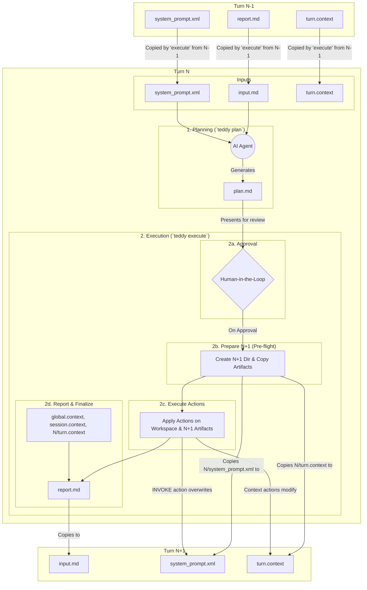

# Interactive Session Workflow Specification

## 1. Overview

This document specifies the design and behavior of the interactive, file-based session workflow for TeDDy. The goal is to create a robust, stateless, and versionable workflow that provides a complete, auditable history of the AI collaboration.

The core of this workflow is the **Report-Centric Lifecycle**: the `report.md` from the previous turn serves as the single, complete input for the AI's next planning phase. This simplifies the system by creating a clear, linear flow of information from one turn to the next.

## 2. The Turn Lifecycle

The entire session is a sequence of "turns," where each turn consists of a planning phase and an execution phase, including an explicit user approval step.



## 3. The Core Directory Structure

The system uses a top-level `.teddy/` directory to store all persistent data. The turn directories are now simplified to reflect the new report-centric model.

```
.teddy/
├── memos.yaml                   # Global, persistent memory file
└── sessions/
    └── 20260124-add-user-auth/      # Session Directory
        └── 01/                      # Turn 1
            ├── input.md             # A copy of the previous turn's report.md (the AI's worldview)
            ├── system_prompt.xml    # The system prompt used for this turn's planning phase
            ├── plan.md              # The plan generated by the AI for this turn
            └── report.md            # The execution report of this turn's plan
```

## 4. Core Artifacts

-   **`input.md`**: A verbatim copy of the previous turn's `report.md`. It serves as the complete, self-contained worldview for the AI's planning phase in the current turn.
-   **`system_prompt.xml`**: The system prompt providing the core instructions to the AI for the planning phase.
-   **`plan.md`**: The raw markdown file generated by the AI for the current turn. It is the immutable input to the `execute` command.
-   **`report.md`**: The factual record of the execution of `plan.md`. It is the immutable output of the `execute` command.
-   **`.teddy/memos.yaml`**: A global YAML file for the AI's long-term memory.
    -   **Example Format:**
        ```yaml
        - All API endpoints must be documented in OpenAPI spec.
        - Use 'pnpm' for all package management.
        ```

## 5. Context Management

Context is determined by a cascading hierarchy of files, which are then snapshotted into the `report.md` for the AI to consume.

1.  **Static Context (User-Managed):**
    -   `.teddy/global.context`: Defines file paths included in *every* session.
    -   `<session>/session.context`: Defines file paths relevant for the entire session.
2.  **Dynamic Context (AI-Managed):**
    -   `turn.context`: Contains the file paths for the current turn's "working set." This file is not edited directly by the user.
3.  **The Workflow:**
    -   The AI proposes changes to the dynamic context via the `Active Context` block in its `plan.md`.
    -   The `teddy execute` tool first copies the current turn's `turn.context` file to the *next* turn's directory. It then applies any `Active Context` changes from the plan to that new file, ensuring all modifications are forward-looking.
    -   When generating `report.md`, the tool aggregates file paths from `global.context`, `session.context`, and the new `turn.context`.
    -   The full contents of all these files are written to the `Resource Contents` section of the report's `Workspace Snapshot`. This complete snapshot becomes the AI's worldview for the next planning phase.

## 6. CLI Command Specification

This section defines the top-level commands for managing the session workflow.

---

### `teddy new <name>`

Initializes a new session directory and bootstraps it for "Turn 1".

-   **Arguments:**
    -   `<name>`: A descriptive, kebab-case name for the session (e.g., "implement-auth-flow").
-   **Behavior:**
    1.  Creates the session directory and the `01/` turn directory.
    2.  Creates the session-specific context file at `<session>/session.context`.
    3.  Assembles a "seed" context from `.teddy/global.context` and `<session>/session.context`.
    4.  Generates a bootstrap `00/report.md` in a temporary location, containing only the seed context.
    5.  Copies this bootstrap report to `01/input.md`.
    6.  Uses `teddy get-prompt` to fetch the default agent prompt and saves it as `01/system_prompt.xml`.
    7.  The session is now ready for the user to run `teddy plan` or `teddy resume`.
    8.  Outputs the path to the new session directory.

---

### `teddy plan`

Generates a `plan.md` within a turn directory.

-   **Options:**
    -   `-m, --message <message>`: The user's prompt/instruction for this turn.
-   **Behavior:**
    1.  Operates within the context of the current turn directory (e.g., `01/`).
    2.  Reads the content of `01/input.md` and `01/system_prompt.xml`.
    3.  Passes the user's message along with the content of these two files to the LLM.
    4.  Saves the AI's response as `01/plan.md`.

---

### `teddy execute [plan_file]`

Executes a plan, generates a report, and prepares the subsequent turn.

-   **Arguments:**
    -   `[plan_file]`: Path to a `plan.md` file (e.g., `01/plan.md`).
-   **Options:**
    -   `-y`: (Optional) Auto-approve all actions.
-   **Behavior (Sequence of Operations):**
    1.  **Approval Phase:** Initiates the interactive **Approval & Execution Phase**. If the plan is not approved, the command terminates.
    2.  **Prepare Next Turn (Pre-flight):**
        -   Creates the next turn's directory (e.g., `02/`).
        -   Copies `01/system_prompt.xml` to `02/system_prompt.xml`.
        -   If `01/turn.context` exists, it is copied to `02/turn.context`.
    3.  **Action Execution Phase:**
        -   Executes the approved actions from `01/plan.md` sequentially.
        -   If `Active Context` changes are present, they modify the `02/turn.context` file.
        -   If an `INVOKE <agent_name>` action is present, it calls `teddy get-prompt <agent_name>` and **overwrites** the `02/system_prompt.xml` file.
    4.  **Reporting Phase (Post-flight):**
        -   Generates the factual `01/report.md` by snapshotting the workspace *after* all actions are complete. This snapshot's `Resource Contents` are aggregated from `global.context`, `session.context`, and the *original* `01/turn.context`.
    5.  **Finalize Next Turn (Post-flight):**
        -   Copies the newly created `01/report.md` to `02/input.md`. The next turn is now fully prepared.

---

### `teddy resume`

The primary "continue" command for a session. It intelligently determines the next action.

-   **Behavior:**
    1.  Identifies the latest turn directory in the current session.
    2.  **State Check:**
        -   If the turn has a `plan.md` but no `report.md`, it behaves like `teddy execute`.
        -   If the turn is complete (has a `report.md`), it prompts the user for a new message and then behaves like `teddy plan` for the *next* turn.

---

## 7. Approval & Execution Phase

This phase implements a two-tiered workflow to give the user both speed and granular control.

**Tier 1: High-Level Summary & Prompt**
The command first presents a high-level summary of all proposed state changes (`Active Context`, `Memos`) and the actions to be performed.

*Example UI:*
```text
▶ Reviewing Plan: "Bootstrap New Project Component"
--------------------------------------------------------------------

 Active Context:
  [+] ADD:    src/components/new_component/core.py   # Add new core logic file to context.
  [+] ADD:    tests/components/test_new_component.py # Add new test file to context.

 memos.yaml:
  [+] ADD:    All new components must have a core.py file. # Establish a new convention.

 Action Plan:
  - CREATE: 1 file
  - EDIT:   1 file
  - EXECUTE: 1 command

--------------------------------------------------------------------
Execute this plan? (a)pprove all / (m)odify / (s)kip / (q)uit ›
```
-   `(a)pprove all`: Executes the entire plan non-interactively.
-   `(m)odify`: Enters Tier 2 for granular control.
-   `(s)kip`: Aborts execution and prompts for a message to generate a new plan.
-   `(q)uit`: Exits the session.

**Tier 2: Interactive "Modify & Preview" Mode**
If the user selects `(m)odify`, they enter an interactive checklist to configure the plan before execution. The tool will execute all checked items as a single batch, in their original order, once the user confirms their selections.

*Example UI:*
```text
Use [↑/↓] to navigate, [enter] to toggle, [a] to toggle all, [p] to preview details, [s] to confirm.

- Active Context
 │
 ├─[✓] [+] ADD: src/components/new_component/core.py
 └─[✓] [+] ADD: tests/components/test_new_component.py

- Memos
 │
 └─[✓] [+] ADD: All new components must have a core.py file.

- Action Plan
 │
 ├─[ ] CREATE: src/components/new_component/core.py
 ├─[✓] EDIT:   pyproject.toml
 └─[ ] EXECUTE: poetry lock
```
-   **Controls:** Users can navigate the list, toggle items on/off with the spacebar, and press `[enter]` to confirm and execute the configured plan.

-   **Universal On-Demand Previews:** When any item is highlighted, pressing `(p)` will show a detailed preview. This feature is designed to provide complete transparency before execution. The preview mechanism is configurable and follows a defined fallback order (see Configuration section below).
    -   `CREATE`: Shows the full content of the new file.
    -   `READ`: Reads the target file/URL and displays its content.
    -   `EDIT`: Computes and displays a colorized diff of the proposed changes.
    -   `EXECUTE`: Displays the full command and any associated parameters (e.g., `cwd`, `env` variables).
    -   `RESEARCH`: Displays the list of search queries that will be executed.
    -   `CHAT_WITH_USER`: Displays the full message that will be sent to the user.
    -   `INVOKE`: Displays the target agent and the full handoff message.

## 8. Implementation Guide & Reference Prototype

An extensive, iterative prototyping process was conducted to validate the UX and de-risk the technical implementation of this feature. The key learnings from this process are captured below, and the final, polished prototype is included as a canonical reference.

#### Key Implementation Learnings

*   **Component Choice:** The `textual.widgets.Tree` is the correct primary component for the UI, as it natively handles the required hierarchical display.
*   **State Management:** Selection state must be managed by updating a boolean in the `TreeNode.data` dictionary. The UI is then updated by re-rendering the node's label to simulate a checkbox (e.g., `[✓]` or `[ ]`). Direct embedding of widgets like `Checkbox` into a `Tree` is not supported.
*   **Keybindings:** `Ctrl`-based keybindings (`ctrl+s`, `ctrl+a`) proved unreliable across different terminal environments. The final, validated keybinding scheme uses single, non-conflicting letters:
    *   `a` for "toggle all".
    *   `s` for "submit/confirm".
*   **Toggle-All Logic:** The "toggle all" action must use a "select all / unselect all" model. The correct logic is: if *any* item is currently unselected, the action selects all. If *all* items are already selected, it unselects all.
*   **String Manipulation:** When updating node labels, prefixes (`[✓] `) must be stripped robustly to avoid bugs where prefixes are duplicated. A helper function to get the "raw" label text is the recommended approach.

---

## 9. Configuration (`.teddy/config.yaml`)

User-specific behavior for the `teddy` tool can be defined in an optional `.teddy/config.yaml` file.

-   **`preview_command`**: (Optional) A string defining the shell command to use for the `(p)review` feature. The tool will write the preview content to a temporary file and pass its path as the final argument to this command.

    -   *Example for Neovim:* `preview_command: "nvim -R"`
    -   *Example for VS Code:* `preview_command: "code"` # Note: Use without `--wait` for a non-blocking preview.

-   **Previewer Fallback Logic:** When the user triggers a preview, the tool will use the following logic to determine how to display it:
    1.  **Configured Editor:** If `preview_command` is set in `.teddy/config.yaml`, it will be used.
    2.  **Visual Studio Code (Default):** If the `code` command is available in the system's `PATH`, it will be used as the default external editor.
    3.  **In-Terminal Display (Fallback):** If neither of the above is available, a colorized diff or formatted content will be printed directly to the terminal.

---

*(The `teddy branch` command has been removed. Branching can be easily and explicitly achieved by copying a turn directory, for example: `cp -r 02/ 02-branch-01/`.)*
